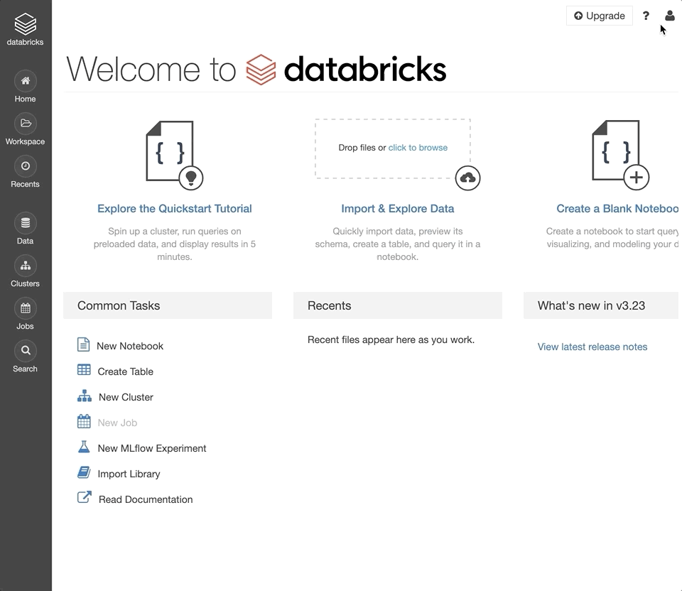

:orphan:

.. _community-edition:

How to Use Glow on Databricks Community Edition
===============================================

Try Glow on Databricks for free with
`Databricks Community Edition <https://databricks.com/product/faq/community-edition>`_.

Step 1: Sign up for Community Edition
-------------------------------------

`Sign up <https://docs.databricks.com/getting-started/try-databricks.html>`_ for a free Databricks trial with
Databricks Community Edition.

1. Fill out the Databricks `free trial form <https://databricks.com/try-databricks>`_ and click "Sign Up".
2. In the "Community Edition" section, click "Get Started".
3. Click the "Get Started" link in your “Welcome to Databricks” verification email.
4. Set your password and click "Reset password". You will be redirected to your Databricks Community Edition workspace.

Step 2: Enable the Databricks Runtime for Genomics
--------------------------------------------------

`Enable <https://docs.databricks.com/administration-guide/clusters/genomics-runtime.html>`_ the Databricks Runtime for
Genomics in your Databricks Community Edition workspace. The Databricks Runtime for Genomics includes Glow.

1. Log into your `Databricks Community Edition workspace <https://community.cloud.databricks.com/login.html>`_.
2. Click the `user account icon <https://docs.databricks.com/administration-guide/admin-console.html>`_ in the top
   right corner of your workspace.
3. Select "Admin Console".
4. In the admin console, select the "Advanced" tab.
5. Next to the "Databricks Runtime for Genomics" section, click "Enable".
6. Refresh the page for this setting to take effect.

|div-clear|

Step 3: Import Glow notebooks
-----------------------------

`Import <https://docs.databricks.com/notebooks/notebooks-manage.html#import-a-notebook>`_ the Glow demonstration
notebooks to your Databricks Community Edition workspace.

.. image:: import-dbc.gif
   :alt: Import demo notebooks
   :align: right
   :scale: 45 %

1. Log into your `Databricks Community Edition workspace <https://community.cloud.databricks.com/login.html>`_.
2. Download the :download:`DBC archive <./glow-demo.dbc>`.
3. Click the `Workspace button <https://docs.databricks.com/workspace/workspace-objects.html#workspace-root-folder>`_
   in the left sidebar of your workspace.
4. In your user folder, right-click and select "Import".
5. Select "Import from file", select the downloaded DBC archive, and click "Import".

|div-clear|

Step 4: Create a cluster
------------------------

`Create <https://docs.databricks.com/clusters/create.html>`_ the cluster shortly before you run the notebooks; the
cluster will be automatically terminated after an idle period of 2 hours.

.. image:: create-genomics-cluster.gif
   :alt: Create a cluster with the Genomics Runtime
   :align: right
   :scale: 45 %

1. Log into your `Databricks Community Edition workspace <https://community.cloud.databricks.com/login.html>`_.
2. Click the `Clusters button <https://docs.databricks.com/clusters/create.html>`_ in the left sidebar of your
   workspace.
3. Set the "Cluster Name" as desired.
4. Under the "Databricks Runtime Version" dropdown, select the
   `latest <https://docs.databricks.com/release-notes/runtime/releases.html>`_ version of the Genomics Runtime.
5. Under the "Spark" tab, set the Environment Variable ``refGenomeId=grch38``. This will initialize the cluster with
   human genome assembly 38 installed.
6. Click "Create Cluster".
7. Refresh the page to see your new cluster in the list.

|div-clear|

Step 5: Attach cluster-scoped libraries
---------------------------------------

`Install <https://docs.databricks.com/libraries/cluster-libraries.html>`_ libraries to a cluster in order to run
third-party code.

.. image:: attach-mlflow.gif
   :alt: Attach MLflow to the cluster
   :align: right
   :scale: 45 %

1. Log into your `Databricks Community Edition workspace <https://community.cloud.databricks.com/login.html>`_.
2. Click the `Clusters button <https://docs.databricks.com/clusters/create.html>`_ in the left sidebar of your
   workspace.
3. Click an existing cluster.
4. Select the "Libraries" tab.
5. Click "Install New."
6. Set the "Library Source" to "PyPi" and set the "Package" field to ``mlflow``. Click "Install".
7. Repeat the previous steps with the library ``bioinfokit``.

|div-clear|

.. |div-clear| raw:: html

    

