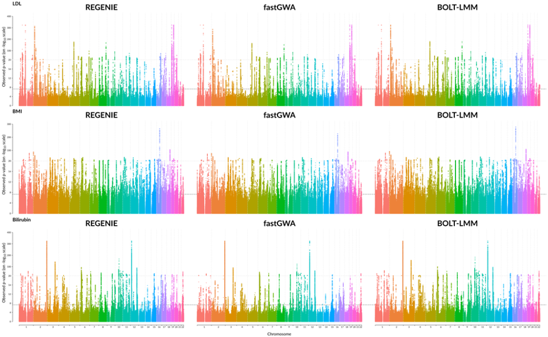
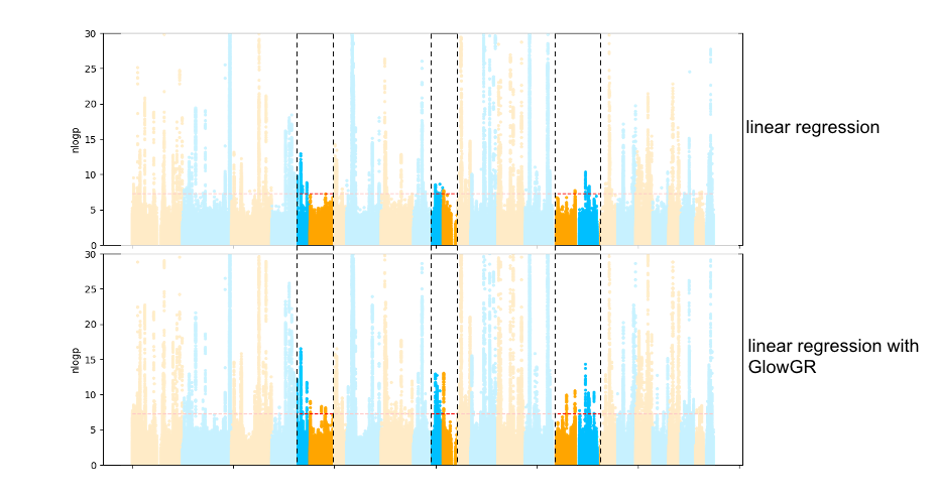
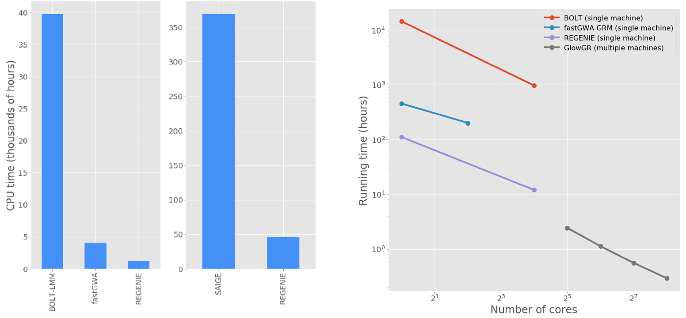
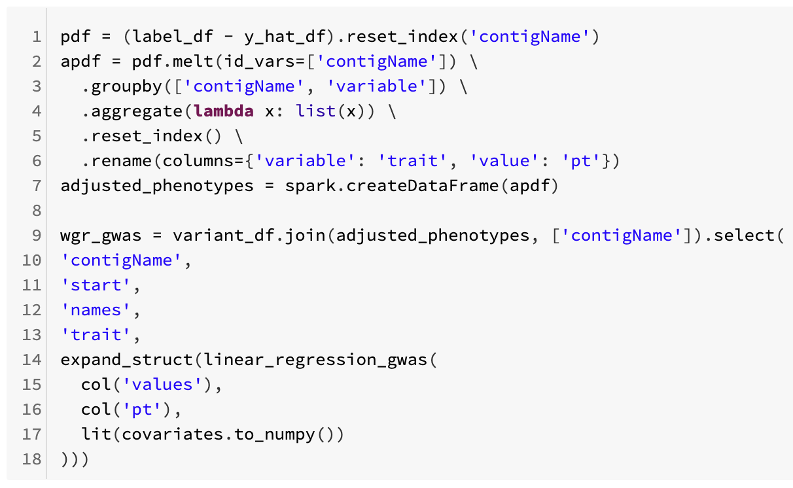

========================================================================================================
Introducing GloWGR: An industrial-scale, ultra-fast and sensitive method for genetic association studies
========================================================================================================

Authors:
`Leland Barnard <https://github.com/LelandBarnard>`_,
`Henry Davidge <https://github.com/henrydavidge>`_,
`Karen Feng <https://github.com/karenfeng>`_,
`Joelle Mbatchou <https://github.com/joellesophya>`_,
`Boris Boutkov <https://github.com/bboutkov>`_,
`Kiavash Kianfar <https://github.com/kianfar77>`_,
`Lukas Habegger <https://github.com/habeggel>`_,
`Jonathan Marchini <https://github.com/jmarchini>`_,
`Jeffrey Reid <https://github.com/jgreid>`_,
`Evan Maxwell <https://github.com/emaxwell>`_,
`Frank Austin Nothaft <https://github.com/fnothaft>`_

June 22, 2020

*The industry partnership between Regeneron and Databricks is
enabling innovations in genomics data processing and analysis. Today, we
announce that we are making a new whole genome regression method available
to the open source bioinformatics community as part of Project Glow.*

Large cohorts of individuals with paired clinical and genome sequence
data enable unprecedented insight into human disease biology. Population
studies such as the `UK Biobank`_, `Genomics England`_, or `Genome Asia
100k`_ datasets are driving a need for innovation in methods for working
with genetic data. These methods include genome wide association studies
(GWAS), which enrich our understanding of the genetic architecture of
the disease and are used in cutting-edge industrial applications, such
as identifying `therapeutic targets for drug development`_. However,
these datasets pose novel statistical and engineering challenges. The
statistical challenges have been addressed by tools such as SAIGE and
Bolt-LMM, but they are difficult to set up and prohibitively slow to run
on biobank-scale datasets.

In a typical GWAS, a single phenotype such as cholesterol levels or
diabetes diagnosis status is tested for statistical association with
millions of genetic variants across the genome. Sophisticated mixed
model and whole genome regression-based approaches have been developed
to control for relatedness and population structure inherent to large
genetic study populations when testing for genetic associations; several
methods such as `BOLT-LMM`_, `SAIGE`_, and `fastGWA`_ use a technique
called whole genome regression to sensitively analyze a single phenotype
in biobank-scale projects. However, deeply phenotyped biobank-scale
projects can require tens of thousands of separate GWASs to analyze the
full spectrum of clinical variables, and current tools are still
prohibitively expensive to run at scale. In order to address the
challenge of efficiently analyzing such datasets, the Regeneron Genetics
Center has just developed a new approach for the whole-genome regression
method that enables running GWAS across upwards of hundreds of
phenotypes simultaneously. This exciting new tool provides the same
superior test power as current state-of-the-art methods at a small
fraction of the computational cost.

This new whole genome regression (WGR) approach recasts the whole genome
regression problem to an ensemble model of many small, genetic
region-specific models. This method is described in a `preprint released
today`_, and implemented in the `C++ tool regenie`_. As part of the
collaboration between the Regeneron Genetics Center and Databricks on
the open source `Project Glow`_, we are excited to announce GloWGR, a
lightning-fast and highly scalable distributed implementation of this
WGR algorithm, designed from the ground up with Apache Spark and
integrated with other Glow functionality. With GloWGR, performing WGR
analyses on dozens of phenotypes can be accomplished simultaneously in a
matter of minutes, a task that would require hundreds or thousands of
hours with existing state-of-the-art tools. Moreover, GloWGR distributes
along both the sample and genetic variant matrix dimensions, allowing
for linear scaling and a high degree of data and task parallelism.
GloWGR plugs seamlessly into any existing GWAS workflow, providing an
immediate boost to association detection power at a negligible
computational cost.

Achieving High Accuracy and Efficiency with Whole-Genome Regression
===================================================================

This whole genome regression tool has a number of virtues. First, it is
more efficient: as implemented in the `single node, open-source regenie
tool`_, whole genome regression is orders of magnitude faster than
either SAIGE, Bolt-LMM, or fastGWA, while producing equivalent results
(Figure 1). Second, it is straightforward to parallelize: in the next
section, we describe how we implemented whole genome regression using
Apache Spark™ in the open-source `Project Glow`_.

   Comparison of GWAS results for three quantitative phenotypes from the
   UK Biobank project, produced by REGENIE, BOLT-LMM, and fastGWA.

In addition to performance considerations, the whole genome regression
approach produces covariates that are compatible with standard GWAS
methods, and which eliminate spurious associations caused by population
structure that are seen with traditional approaches. The Manhattan plots
in figure 2 below compare the results of a traditional linear regression
GWAS using standard covariates, to a linear regression GWAS using the
covariates generated by WGR. This flexibility of GloWGR is another tremendous
advantage over existing GWAS tools, and will allow for a wide variety of exciting
extensions to the association testing framework that is already available in Glow.

   Comparison of GWAS results of the quantitative phenotype
   bilirubin from the UK Biobank project, evaluated using standard linear
   regression and linear regression with GloWGR. The heightened peaks in
   the highlighted regions show the increase in power to detect subtler
   associations that is gained with GloWGR.

Figure 3 shows performance comparisons between GloWGR, REGENIE, BoltLMM,
and fastGWA. We benchmarked the whole genome regression test implemented
in Glow against the C++ implementation available in the `single-node
regenie tool`_ to validate the accuracy of the method. We found that the
two approaches achieve statistically identical results. We also found
that the Apache Spark™ based implementation in Glow scales linearly with
the number of nodes used.

   Left: end-to-end GWAS runtime comparison for 50
   quantitative traits from the UK Biobank project. Right: Run time
   comparison to fit WGR models against 50 quantitative phenotypes from the
   UK Biobank project. GloWGR scales well with cluster size, allowing for
   modeling of dozens of phenotypes in minutes without costing additional
   CPU efficiency. The exact list of phenotypes and computation environment
   details can be found `here`_.

Scaling Whole Genome Regression within Project Glow
===================================================

Performing WGR analysis with GloWGR has 5 steps:

-  Dividing the genotype matrix into contiguous blocks of SNPs (~1000
   SNPs per block, referred to as loci)
-  Fitting multiple ridge models (~10) with varying ridge penalties
   within each locus
-  Using the resulting ridge models to reduce the locus from a matrix of
   1,000 features to 10 features (each feature is the prediction of one
   of the ridge models)
-  Pooling the resulting features of all loci into a new reduced feature
   matrix *X* (*N* individuals by *L* loci x *J* ridge models per locus)
-  Fitting a final regularized model from *X* for the genome-wide
   contribution to phenotype *Y*.

Glow provides the easy-to-use abstractions shown in figure 4 for
transforming large genotype matrices into the blocked matrix (below,
left) and then fitting the whole genome regression model (below, right).
These can be applied to data loaded in any of the `genotype file formats
that Glow understands, including VCF, Plink, and BGEN formats`_, as well
as genotype data stored in Apache Spark™ native file formats like `Delta
Lake`_.

.. figure:: fig4.png
   :align: center
   :width: 650
   :name: fig4

   Creating a matrix grouped by locus and fitting mixed
   ridge regression models using GloWGR

Glow provides an implementation of the WGR method for quantitative
traits, and a binary trait variant is in progress. The
covariate-adjusted phenotype created by GloWGR can be written out as an
`Apache Parquet`_ ™ or `Delta Lake`_ dataset, which can easily be
loaded by and analyzed within `Apache Spark`_, `pandas`_, and other
tools. Ultimately, using the covariates computed with WGR in a
genome-wide association study is as simple as running the command shown
in Figure 5, below. This command is run by Apache Spark™, in parallel, across all of the
genetic markers under test.

   Updating phenotypes with the WGR results and running a
   GWAS using the `built-in association test methods from Glow`_

Join us and try whole genome regression in Glow!
================================================

Whole genome regression is available in `Glow`_, which is an open source
project `hosted on Github`_, with an Apache 2 license. You can get
started with `this notebook`_ that shows how to use GloWGR on data from
1,000 Genomes, by reading the `preprint`_, by `reading our project
docs`_, or you can `create a fork of the repository`_ to start
contributing code today. Glow is installed in the Databricks Genomics
Runtime (`Azure`_ | `AWS`_), and you can `start a preview today`_.

.. _UK Biobank: https://www.ukbiobank.ac.uk/
.. _Genomics England: https://www.genomicsengland.co.uk/
.. _Genome Asia 100k: https://genomeasia100k.org/
.. _therapeutic targets for drug development: https://www.biorxiv.org/content/10.1101/2020.06.02.129908v1
.. _BOLT-LMM: https://www.nature.com/articles/ng.3190
.. _SAIGE: https://www.nature.com/articles/s41588-018-0184-y/
.. _fastGWA: https://www.nature.com/articles/s41588-019-0530-8
.. _preprint released today: https://www.biorxiv.org/content/10.1101/2020.06.19.162354v1
.. _C++ tool regenie: https://rgcgithub.github.io/regenie/
.. _Project Glow: http://projectglow.io
.. _single node, open-source regenie tool: https://rgcgithub.github.io/regenie/
.. _single-node regenie tool: https://rgcgithub.github.io/regenie/
.. _here: https://www.biorxiv.org/content/10.1101/2020.06.19.162354v1
.. _genotype file formats that Glow understands, including VCF, Plink, and BGEN formats: https://glow.readthedocs.io/en/latest/etl/variant-data.html
.. _Delta Lake: https://delta.io/
.. _Apache Parquet: http://parquet.apache.org
.. _Apache Spark: http://spark.apache.org
.. _pandas: https://pandas.pydata.org/
.. _built-in association test methods from Glow: https://glow.readthedocs.io/en/latest/tertiary/regression-tests.html
.. _Glow: http://projectglow.io
.. _hosted on Github: https://github.com/projectglow/glow
.. _this notebook: https://glow.readthedocs.io/en/latest/tertiary/whole-genome-regression.html
.. _preprint: https://www.biorxiv.org/content/10.1101/2020.06.19.162354v1
.. _reading our project docs: http://projectglow.io
.. _create a fork of the repository: https://github.com/projectglow/glow/fork
.. _Azure: https://docs.microsoft.com/en-us/azure/databricks/runtime/genomicsruntime#dbr-genomics
.. _AWS: https://docs.databricks.com/runtime/genomicsruntime.html#dbr-genomics
.. _start a preview today: https://pages.databricks.com/genomics-preview.html
