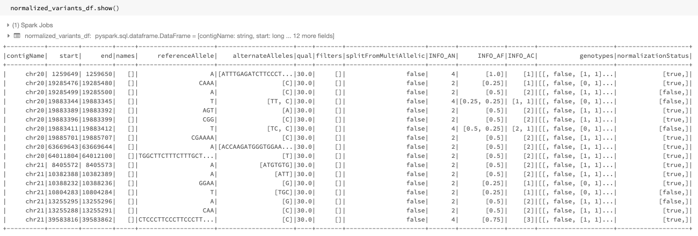
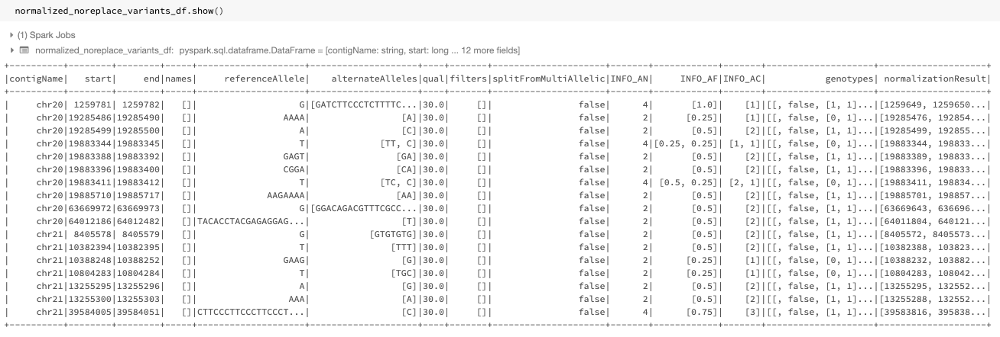
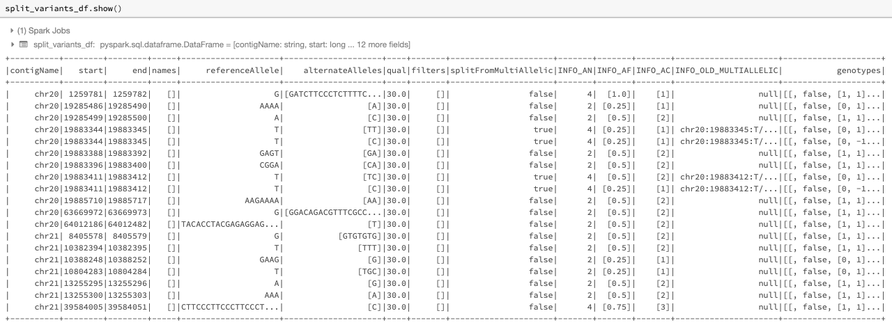
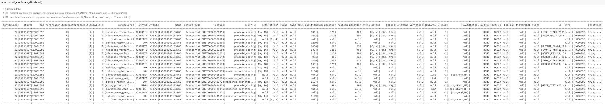

=======================================================================
Glow 0.3.0 Introduces Several New Large-Scale Genomic Analysis Features
=======================================================================

| Author: `Kiavash Kianfar <https://github.com/kianfar77>`_
| February 28, 2020

Glow 0.3.0 was recently released and contains exciting new and improved features aimed at advancing Glow's power and ease of use in performing large-scale genomic analysis. In this blog, we overview the main new and improved features in this release.

An improved transformer to normalize variants
~~~~~~~~~~~~~~~~~~~~~~~~~~~~~~~~~~~~~~~~~~~~~
The variant normalizer received a major improvement in this release. The normalizer still behaves like `bcftools norm <https://www.htslib.org/doc/bcftools.html#norm>`_ and `vt normalize <https://genome.sph.umich.edu/wiki/Vt#Normalization>`_, but is about 2.5x faster and has a much more flexible API. Moreover, the new normalizer is implemented as a function in addition to a transformer.

The improved ``normalize_variants`` transformer preserves the columns of the input DataFrame, adds the normalization status to the DataFrame, and has the option of adding the normalization results (including the normalized coordinates and alleles) to the DataFrame as a new column. As an example, assume we read the ``original_variants_df`` DataFrame shown in :numref:`figorigdf` by issuing the following command

.. code-block::

  original_variants_df = spark.read \
    .format("vcf") \
    .option("includeSampleIds", False) \
    .load("/databricks-datasets/genomics/call-sets")

.. figure:: figorigdf.png
   :align: center
   :width: 800
   :name: figorigdf

   The variant DataFrame ``original_variants_df``

The improved normalizer transformer can be applied on this DataFrame using the following command similar to the previous version:

.. code-block::

  import glow
  normalized_variants_df = glow.transform("normalize_variants", \
    original_variants_df, \
    reference_genome_path="/mnt/dbnucleus/dbgenomics/grch38/data/GRCh38_full_analysis_set_plus_decoy_hla.fa" \
  )

The output DataFrame of this improved normalizer looks like :numref:`fignormdf`, where the ``start``, ``end``,  ``referenceAllele``, and ``alternateAlleles`` fields are updated by the normalized values and a ``normalizationStatus`` column is added to the DataFrame containing a ``changed`` subfield indicating whether the normalization changed the variant and an ``errorMessage`` subfield containing the error message in case of an error.

   The normalized DataFrame ``normalized_variants_df``

The newly introduced ``replace_columns`` option can be used to add the normalization results as a new column to the DataFrame instead of replacing the original ``start``, ``end``,  ``referenceAllele``, and ``alternateAlleles`` fields. This can be done as follows:

.. code-block::

  import glow
  normalized_variants_df = glow.transform("normalize_variants",\
    original_variants_df, \
    replace_columns="Flase", \
    reference_genome_path="/mnt/dbnucleus/dbgenomics/grch38/data/GRCh38_full_analysis_set_plus_decoy_hla.fa" \
  )

The resulting DataFrame will be as show in :numref:`fignormnorepdf`, where a ``normalizationResults`` column containing the normalized ``start``, ``end``,  ``referenceAllele``, ``alternateAlleles``, and ``normalizationStatus`` subfields is added to the DataFrame.

   The normalized DataFrame ``normalized_noreplace_variants_df`` with normalization results added as a new column

We also note that since the multiallelic variant splitter is implemented as a separate transformer in this release (see below), the ``mode`` option of the ``normalize_variants`` transformer is deprecated. Refer to :ref:`variantnormalization` for more details on the ``normalize_variants`` transformer.

As mentioned, in this release, variant normalization can also be performed using the newly introduced ``normalize_variant`` SQL expression function. This can be done as follows:

.. code-block::

  from pyspark.sql.functions import expr
  function_normalized_variants_df = original_variants_df.withColumn( \
    "normalizationResult", \
    expr("normalize_variant(contigName, start, end, referenceAllele, alternateAlleles, '/mnt/dbnucleus/dbgenomics/grch38/data/GRCh38_full_analysis_set_plus_decoy_hla.fa')") \
  )

The result of the above command will be the same as :numref:`fignormnorepdf`. See :ref:`Glow PySpark Functions<pyspark_functions>` for more details on the ``normalize_variant`` function.

A new transformer to split multiallelic variants
~~~~~~~~~~~~~~~~~~~~~~~~~~~~~~~~~~~~~~~~~~~~~~~~~
This release also introduced a new DataFrame transformer, called ``split_multiallelics``, to split multiallelic variants into biallelic ones with a behavior similar to `vt decompose <https://genome.sph.umich.edu/wiki/Vt#Decompose>`_ with ``-s`` option. This behavior is significantly more powerful than the behavior of the previous version's splitter which behaved like GATK’s `LeftAlignAndTrimVariants <https://gatk.broadinstitute.org/hc/en-us/articles/360037225872-LeftAlignAndTrimVariants>`_ with ``--split-multi-allelics``. In particular, the array-type ``INFO`` fields and genotype fields with entries corresponding to each of alternate alleles and/or reference allelles are split smartly into biallelic rows. So are the genotype fields with entries corresponding to all possible genotype calls sorted in colex order, e.g., the ``GL``, ``PL``, and ``GP`` fields of the VCF format. Moreover, an ``OLD_MULTIALLELIC`` ``INFO`` field is added to the DataFrame to store the original multiallelic form of the biallelic variants resulting form splitting.

The following is an example of using the ``split_multiallelic`` transformer on the ``original_variants_df``:

.. code-block::

  import glow
  split_variants_df = glow.transform("split_multiallelics", original_variants_df)

The resulting DataFrame is as in :numref:`figsplitdf`.

   The split DataFrame ``split_variants_df``

It should be note that the new splitter is implemented as a separate transformer from the ``normalize_variants`` transformer, as opposed to the previous version's splitter where the splitting could only be done as one of the operation modes of the ``normalize_variants`` transformer using the now-deprecated ``mode`` option.

Please refer to the :ref:`documentation of the split_multiallelics transformer<split_multiallelics>` for complete details on the bahavior of this new transformer.

Python and Scala APIs for Glow SQL functions
~~~~~~~~~~~~~~~~~~~~~~~~~~~~~~~~~~~~~~~~~~~~
Excitingly, in this release, Python and Scala APIs were introduced for all Glow SQL functions. Therefore, unlike previous versions where Glow SQL functions could only be used in SQL expressions, they can now be written in Python or Scala as well similar to what can be done for Spark SQL functions. In addition to improved simplicity, this provides enhanced compile-time safety. The SQL functions and their Python and Scala clients are generated from the same source so any new functionality in the future will always appear in all three languages. Please refer to :ref:`pyspark_functions` for more information on Python APIs for these functions.

As an example, the ``normalize_variant`` function which was used within a SQL expression above, can also be written as a Python function as follows:

.. code-block::

  from glow.functions import normalize_variant
  function_normalized_variants_df = original_variants_df.withColumn( \
    "normalizationResult", \
    normalize_variant("contigName", "start", "end", "referenceAllele", "alternateAlleles", "/mnt/dbnucleus/dbgenomics/grch38/data/GRCh38_full_analysis_set_plus_decoy_hla.fa") \
  )

The same can be done in Scala assuming ``original_variant_df`` is defined in Scala:

.. code-block:: scala

  import io.projectglow.functions.normalize_variant
  import org.apache.spark.sql.functions.col
  val function_normalized_variants_df = original_variants_df.withColumn(
    "normalizationResult",
    normalize_variant(col("contigName"), col("start"), col("end"), col("referenceAllele"), col("alternateAlleles"), "/mnt/dbnucleus/dbgenomics/grch38/data/GRCh38_full_analysis_set_plus_decoy_hla.fa")
  )

Parsing of Annotation Fields
~~~~~~~~~~~~~~~~~~~~~~~~~~~~
In this release, the VCF reader and pipe transformer received equipment to parse ``ANN`` and ``CSQ`` ``INFO`` fields resulting form annotation tools such as `SnpEff <http://snpeff.sourceforge.net/index.html>`_ and  `VEP <https://www.ensembl.org/info/docs/tools/vep/index.html>`_ tools into a structured format instead of putting them as flat strings in the ``INFO`` field. This makes queries on annotations much simpler to write and much faster. An example of such a query in shown below with its result displayed in :numref:`figcsqdf`:

.. code-block::

  from pyspark.sql.functions import expr
  variants_df = spark.read\
    .format("vcf")\
    .load("dbfs:/databricks-datasets/genomics/vcfs/loftee.vcf")
  annotated_variants_df = original_variants_df.withColumn("Exploded_INFO_CSQ", expr("explode(INFO_CSQ)")).selectExpr("contigName", "start", "end", "referenceAllele", "alternateAlleles", "expand_struct(Exploded_INFO_CSQ)", "genotypes")

   The annotated DataFrame ``annotated_variants_df`` with expanded subfields of the exploded ``INFO_CSQ``

Other Improvements
~~~~~~~~~~~~~~~~~~
This release also brought about improved implementations of Glow's linear and logistic regression functions resulting in ~50% improvement in their performance. The manner in which these functions are used remained unchanged and can be found in their documentations at :ref:`linear-regression` and :ref:`logistic-regression`, respectively.

Furthermore, the new release supports Scala 2.11 and 2.12 unlike previous releases that only supported Scala 2.11. The maven artifacts for both Scala versions are available on `Maven Central <https://search.maven.org/search?q=g:io.projectglow>`_.

Try It!
~~~~~~~
Try Glow 0.3.0 and its new features `here <https://projectglow.io/>`_.