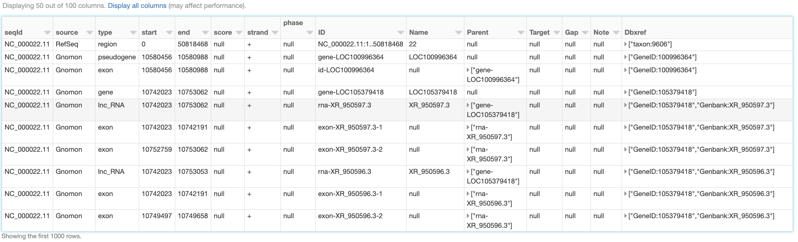
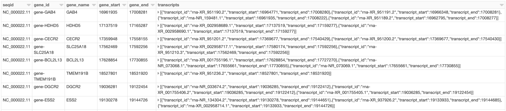
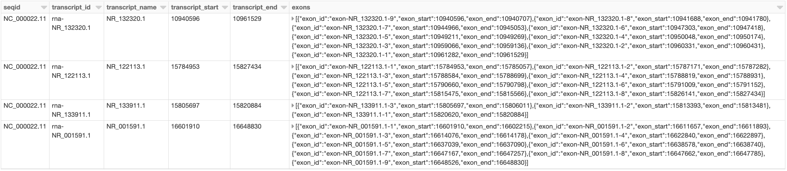
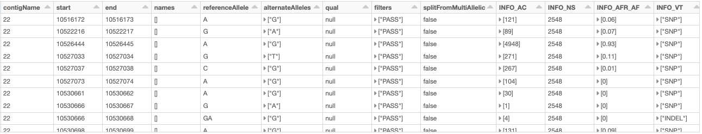
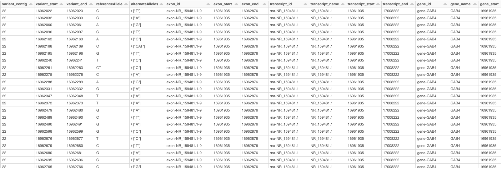

===================================================================
Glow 0.4 Enables Integration of Genomic Variant and Annotation Data
===================================================================

| Author: `Kiavash Kianfar <https://github.com/kianfar77>`_
| June 9, 2020

.. _`GFF3`: https://github.com/The-Sequence-Ontology/Specifications/blob/master/gff3.md
Glow 0.4 was released on May 20, 2020. This blog focuses on the highlight of this release, the newly introduced capability to ingest genomic annotation data from the `GFF3 (Generic Feature Format Version 3) <https://github.com/The-Sequence-Ontology/Specifications/blob/master/gff3.md>`_ flat file format. This release also includes other feature and usability improvements, which will be briefly reviewed at the end of this blog.

`GFF3`_ is a sequence annotation flat file format proposed by the `Sequence Ontology Project <http://www.sequenceontology.org/>`_ in 2013, which since has become the de facto format for genome annotation and is widely used by genome browsers and databases such as NCBI `RefSeq <https://www.ncbi.nlm.nih.gov/refseq/>`_ and `GenBank <https://www.ncbi.nlm.nih.gov/genbank/>`_. `GFF3`_, a 9-column tab-separated text format, typically carries the majority of the annotation data in the ninth column, called ``attributes``, as a semi-colon-separated list of ``<tag>=<value>`` entries. As a result, although GFF3 files can be read as Spark DataFrames using Spark SQL's standard ``csv`` data source, the schema of the resulting DataFrame would be quite unwieldy for query and data manipulation of annotation data, because the whole list of attribute tag-value pairs for each sequence will appear as a single semi-colon-separated string in the ``attributes`` column of the DataFrame.

Glow 0.4 adds the new and flexible ``gff`` Spark SQL data source to address this challenge and create a smooth GFF3 ingest and query experience. While reading the GFF3  file, the ``gff`` data source parses the ``attributes`` column of the file to create an appropriately typed column for each tag. In each row, this column will contain the value corresponding to that tag in that row (or ``null`` if the tag does not appear in the row). Consequently, all tags in the GFF3 ``attributes`` column will have their own corresponding column in the Spark DataFrame, making annotation data query and manipulation much easier.

.. _gff3_ingest:

Ingesting GFF3 Annotation Data
~~~~~~~~~~~~~~~~~~~~~~~~~~~
Like any other Spark data source, reading GFF3 files using Glow's ``gff`` data source can be done in a single line of code. As an example, we can ingest the annotations of the Homo Sapiens genome assembly GRCh38.p13 from a GFF3 file (obtained from `RefSeq ftp site <https://ftp.ncbi.nlm.nih.gov/genomes/refseq/vertebrate_mammalian/Homo_sapiens/reference/GCF_000001405.39_GRCh38.p13/>`_) as shown below. Here, we have also filtered the annotations to chromosome 22 in order to use the resulting ``annotations_df`` DataFrame (:numref:`fig_annotations_df`) in continuation of our example. The ``annotations_df`` alias is for the same purpose as well.

.. _annotations_df:

.. code-block::

  import glow
  glow.register(spark)

  gff_path = '/databricks-datasets/genomics/gffs/GCF_000001405.39_GRCh38.p13_genomic.gff.bgz'

  annotations_df = spark.read.format('gff').load(gff_path) \
      .filter("seqid = 'NC_000022.11'") \
      .alias('annotations_df')

   A small section of the ``annotations_df`` DataFrame

In addition to reading uncompressed ``.gff`` files, the ``gff`` data source supports all compression formats supported by Spark's ``csv`` data source, including ``.gz`` and ``.bgz``. It is strongly recommended to use splittable compression formats like ``.bgz`` instead of ``.gz`` for better parallelization of the read process.

Schema
~~~~~~
Let us have a closer look at the schema of the resulting DataFrame, which was automatically inferred by  Glow's ``gff`` data source:

.. code-block::

  annotations_df.printSchema()

.. code-block::

    root
     |-- seqId: string (nullable = true)
     |-- source: string (nullable = true)
     |-- type: string (nullable = true)
     |-- start: long (nullable = true)
     |-- end: long (nullable = true)
     |-- score: double (nullable = true)
     |-- strand: string (nullable = true)
     |-- phase: integer (nullable = true)
     |-- ID: string (nullable = true)
     |-- Name: string (nullable = true)
     |-- Parent: array (nullable = true)
     |    |-- element: string (containsNull = true)
     |-- Target: string (nullable = true)
     |-- Gap: string (nullable = true)
     |-- Note: array (nullable = true)
     |    |-- element: string (containsNull = true)
     |-- Dbxref: array (nullable = true)
     |    |-- element: string (containsNull = true)
     |-- Is_circular: boolean (nullable = true)
     |-- align_id: string (nullable = true)
     |-- allele: string (nullable = true)
     .
     .
     .
     |-- transl_table: string (nullable = true)
     |-- weighted_identity: string (nullable = true)

This schema has 100 fields (not all shown here). The first eight fields (``seqId``, ``source``, ``type``, ``start``, ``end``, ``score``, ``strand``, and ``phase``), here referred to as the "base" fields, correspond to the first eight columns of the `GFF3`_ format cast in the proper data types. The rest of the fields in the inferred schema are the result of parsing the ``attributes`` column of the GFF3 file. Fields corresponding to any "official" tag (those referred to as "tags with pre-defined meaning" in the `GFF3`_ format description), if present in the GFF3 file, come first in appropriate data types. The official fields are followed by the "unofficial" fields (fields corresponding to any other tag) in alphabetical order. In the example above, ``ID``, ``Name``, ``Parent``, ``Target``, ``Gap``, ``Note``, ``Dbxref``, and ``Is_circular`` are the official fields, and the rest are the unofficial fields. The ``gff`` data source discards the comments, directives, and FASTA lines that may be in the GFF3 file.

As it is not uncommon for the official tags to be spelled differently in terms of letter case and underscore usage across different GFF3 files, or even within a single GFF3 file, the ``gff`` data source is designed to be insensitive to letter case and underscore in extracting official tags from the ``attributes`` field. For example, the official tag ``Dbxref`` will be correctly extracted as an official field even if it appears as ``dbxref`` or ``dbx_ref`` in the GFF3 file. Please see `Glow documentation <https://glow.readthedocs.io/en/latest/etl/gff.html>`_ for more details.

Like other Spark SQL data sources, Glow's ``gff`` data source is also able to accept a user-specified schema through the ``.schema`` command. The data source behavior in this case is also designed to be quite flexible. More specifically, the fields (and their types) in the user-specified schema are treated as the list of fields, whether base, official, or unofficial, to be extracted from the GFF3 file (and cast to the specified types). Please see the `Glow documentation <https://glow.readthedocs.io/en/latest/etl/gff.html>`_ for more details on how user-specified schemas can be used.

Example: Gene Transcripts and Transcript Exons
~~~~~~~~~~~~~~~~~~~~~~~~~~~~~~~~~~~~~~~~~~~~~~
With the annotation tags extracted as individual DataFrame columns using Glow's ``gff`` data source, query and data preparation over genetic annotations becomes as easy as writing common Spark SQL commands in the user's API of choice. As an example, here we demonstrate how simple queries can be used to extract data regarding hierarchical grouping of genomic features from the ``annotations_df`` created :ref:`above <annotations_df>`.

One of the main advantages of the GFF3 format compared to older versions of GFF is the improved presentation of feature hierarchies (see  `GFF3`_ format description for more details). Two examples of such hierarchies are:

- Transcripts of a gene (here, gene is the "parent" feature and its transcripts are the "children" features).
- Exons of a transcript (here, the transcript is the parent and its exons are the children).

In the `GFF3`_ format, the parents of the feature in each row are identified by the value of the ``parent`` tag in the ``attributes`` column, which includes the ID(s) of the parent(s) of the row. Glow's ``gff`` data source extracts this information as an array of parent ID(s) in a column of the resulting DataFrame called ``parent``.

Assume we would like to create a DataFrame, called ``gene_transcript_df``, which, for each gene on chromosome 22, provides some basic information about the gene and all its transcripts.  As each row in  the ``annotations_df`` of our example has at most a single parent, the ``parent_child_df`` DataFrame created by the following query will help us in achieving our goal. This query joins ``annotations_df`` with a subset of its own columns on the ``parent`` column as the key. :numref:`fig_parent_child_df` shows a small section of ``parent_child_df``.

.. code-block::

    from pyspark.sql.functions import *

    parent_child_df = annotations_df \
    .join(
      annotations_df.select('id', 'type', 'name', 'start', 'end').alias('parent_df'),
      col('annotations_df.parent')[0] == col('parent_df.id') # each row in annotation_df has at most one parent
    ) \
    .orderBy('annotations_df.start', 'annotations_df.end') \
    .select(
      'annotations_df.seqid',
      'annotations_df.type',
      'annotations_df.start',
      'annotations_df.end',
      'annotations_df.id',
      'annotations_df.name',
      col('annotations_df.parent')[0].alias('parent_id'),
      col('parent_df.Name').alias('parent_name'),
      col('parent_df.type').alias('parent_type'),
      col('parent_df.start').alias('parent_start'),
      col('parent_df.end').alias('parent_end')
    ) \
    .alias('parent_child_df')

.. figure:: parent_child_df.png
   :align: center
   :width: 800
   :name: fig_parent_child_df

   A small section of the ``parent_child_df`` DataFrame

Having the ``parent_child_df`` DataFrame, we can now write the following simple function, called ``parent_child_summary``, which, given this DataFrame, the parent type, and the child type, generates a DataFrame containing basic information on each parent of the given type and all its children of the given type.

.. code-block::

    from pyspark.sql.dataframe import *

    def parent_child_summary(parent_child_df: DataFrame, parent_type: str, child_type: str) -> DataFrame:
      return parent_child_df \
        .select(
          'seqid',
          col('parent_id').alias(f'{parent_type}_id'),
          col('parent_name').alias(f'{parent_type}_name'),
          col('parent_start').alias(f'{parent_type}_start'),
          col('parent_end').alias(f'{parent_type}_end'),
          col('id').alias(f'{child_type}_id'),
          col('start').alias(f'{child_type}_start'),
          col('end').alias(f'{child_type}_end'),
        ) \
        .where(f"type == '{child_type}' and parent_type == '{parent_type}'") \
        .groupBy(
          'seqid',
          f'{parent_type}_id',
          f'{parent_type}_name',
          f'{parent_type}_start',
          f'{parent_type}_end'
        ) \
        .agg(
          collect_list(
            struct(
              f'{child_type}_id',
              f'{child_type}_start',
              f'{child_type}_end'
            )
          ).alias(f'{child_type}s')
        ) \
        .orderBy(
          f'{parent_type}_start',
          f'{parent_type}_end'
        ) \
        .alias(f'{parent_type}_{child_type}_df')

Now we can generate our intended ``gene_transcript_df`` DataFrame, shown in :numref:`fig_gene_transcript_df`, with a single call to this function:

.. code-block::

    gene_transcript_df = parent_child_summary(parent_child_df, 'gene', 'transcript')

   A small section of the ``gene_transcript_df`` DataFrame

In each row of this DataFrame, the ``transcripts`` column contains the ID, start and end of all transcripts of the gene in that row as an array of structs.

The same function can now be used to generate any parent-child feature summary. For example, we can generate the information of all exons of each transcript on chromosome 22 with another call to the ``parent_child_summary`` function as shown below. :numref:`fig_transcript_exon_df` shows the generated ``transcript_exon_df`` DataFrame.

.. code-block::

    transcript_exon_df = parent_child_summary(parent_child_df, 'transcript', 'exon')

   A small section of the ``transcript_exon_df`` DataFrame

Example Continued: Integration with Variant Data
~~~~~~~~~~~~~~~~~~~~~~~~~~~~~~~~~~~~~~~~~~~~~~~~
Glow has :ref:`data sources to ingest variant data <variant_data>` from common flat file formats such as VCF, BGEN, and PLINK. Combining the power of Glow's variant data sources with the new ``gff`` data source, the users can now seamlessly annotate their variant DataFrames by joining them with annotation DataFrames in any desired fashion.

As an example, let us load the chromosome 22 variants of the 1000 Genome Project from a VCF file (obtained from the project's `ftp site <ftp://ftp.1000genomes.ebi.ac.uk/vol1/ftp/release/20130502/>`_). :numref:`fig_variants_df` shows the resulting ``variants_df``.

.. code-block::

    vcf_path = "/databricks-datasets/genomics/1kg-vcfs/ALL.chr22.phase3_shapeit2_mvncall_integrated_v5a.20130502.genotypes.vcf.gz"

    variants_df = spark.read \
      .format("vcf") \
      .load(vcf_path) \
      .alias('variants_df')

   A small section of the ``variants_df`` DataFrame

Now using the following double-join query, we can create a DataFrame which, for each variant on a gene on chromosome 22, provides the information of the variant as well as the exon, transcript, and gene on which the variant resides (:numref:`fig_variant_exon_transcript_gene_df`). Note that the first two exploded DataFrames can also be constructed directly from ``parent_child_df``. Here, since we had already defined ``gene_transcrip_df`` and ``transcript_exon_df``, we generated these exploded DataFrames simply by applying the ``explode`` function followed by Glow's :ref:`expand_struct <pyspark_functions>` function on them.

.. code-block::

    from glow.functions import *

    gene_transcript_exploded_df = gene_transcript_df \
      .withColumn('transcripts', explode('transcripts')) \
      .withColumn('transcripts', expand_struct('transcripts')) \
      .alias('gene_transcript_exploded_df')

    transcript_exon_exploded_df = transcript_exon_df \
      .withColumn('exons', explode('exons')) \
      .withColumn('exons', expand_struct('exons')) \
      .alias('transcript_exon_exploded_df')

    variant_exon_transcript_gene_df = variants_df \
    .join(
      transcript_exon_exploded_df,
      (variants_df.start < transcript_exon_exploded_df.exon_end) &
      (transcript_exon_exploded_df.exon_start < variants_df.end)
    ) \
    .join(
      gene_transcript_exploded_df,
      transcript_exon_exploded_df.transcript_id == gene_transcript_exploded_df.transcript_id
    ) \
    .select(
      col('variants_df.contigName').alias('variant_contig'),
      col('variants_df.start').alias('variant_start'),
      col('variants_df.end').alias('variant_end'),
      col('variants_df.referenceAllele'),
      col('variants_df.alternateAlleles'),
      'transcript_exon_exploded_df.exon_id',
      'transcript_exon_exploded_df.exon_start',
      'transcript_exon_exploded_df.exon_end',
      'transcript_exon_exploded_df.transcript_id',
      'transcript_exon_exploded_df.transcript_name',
      'transcript_exon_exploded_df.transcript_start',
      'transcript_exon_exploded_df.transcript_end',
      'gene_transcript_exploded_df.gene_id',
      'gene_transcript_exploded_df.gene_name',
      'gene_transcript_exploded_df.gene_start',
      'gene_transcript_exploded_df.gene_end'
    ) \
    .orderBy(
      'variant_contig',
      'variant_start',
      'variant_end'
    )

   A small section of the ``variant_exon_transcript_gene_df`` DataFrame

Other Features and Improvements
~~~~~~~~~~~~~~~~~~~~~~~~~~~~~~~
In addition to the new ``gff`` reader, Glow 0.4 introduced other features and improvements. A new function, called ``mean_substitute``, was introduced, which can be used to substitute the missing values of a numeric Spark array with the mean of the non-missing values. The ``normalize_variants`` transformer now accepts reference genomes in bgzipped fasta format in addition to the uncompressed fasta. The VCF reader was updated to be able to handle reading file globs that include tabix index files. In addition, this reader no longer has the ``splitToBiallelic`` option. The ``split_multiallelics`` transformer introduced in Glow 0.3 can be used instead. Also, the ``pipe`` transformer was improved so that it does not pipe empty partitions. As a result, users do not need to ``repartition`` or ``coalesce`` when piping VCF files. For a complete list of new features and improvements in Glow 0.4, please refer to `Glow 0.4 Release Notes <https://github.com/projectglow/glow/releases>`_.

Try It!
~~~~~~~
Try Glow 0.4 and its new features `here <https://projectglow.io/>`_.