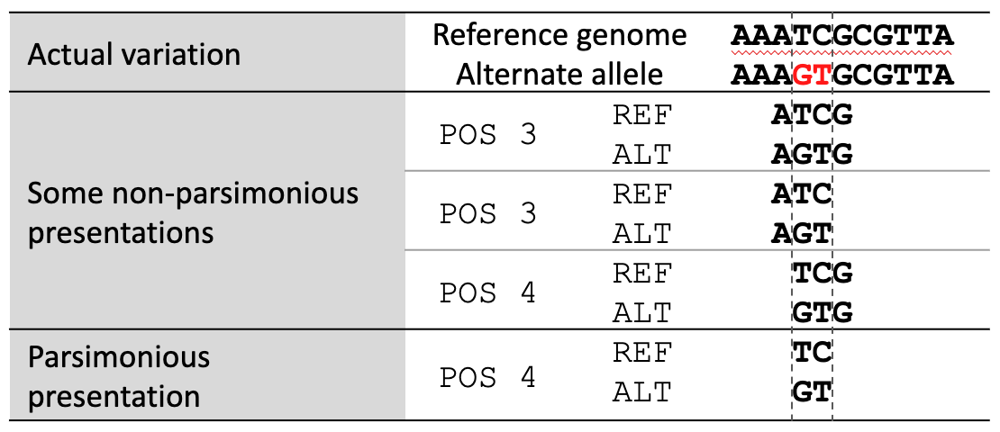
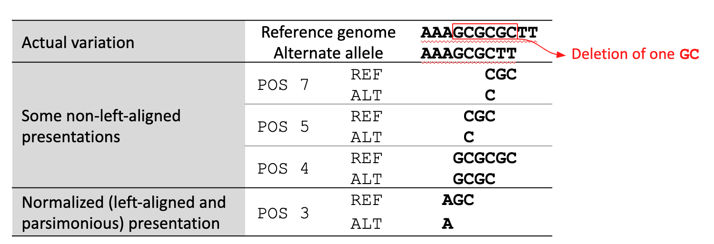
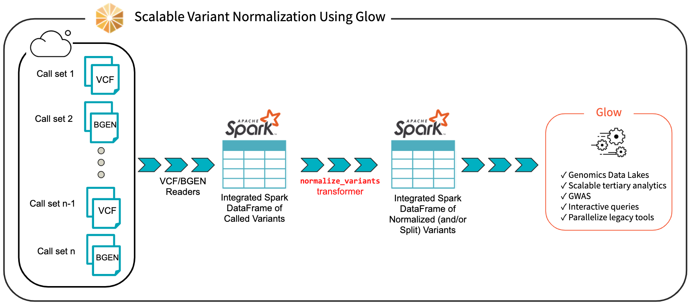
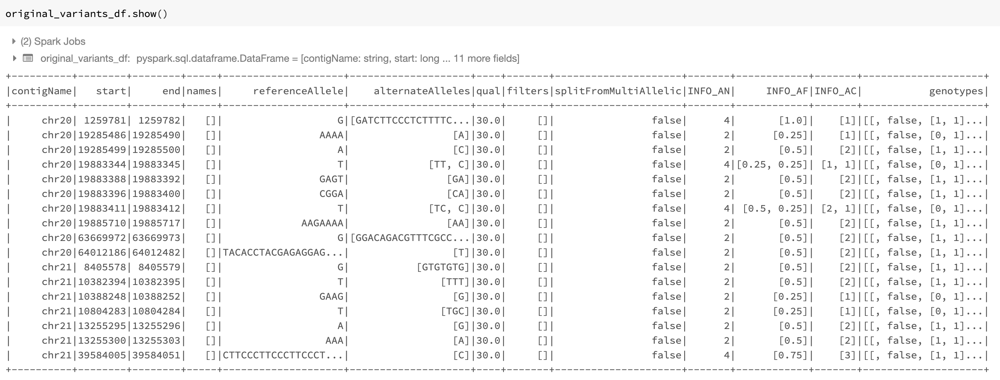
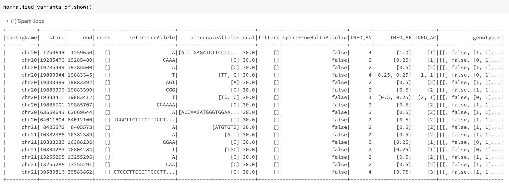
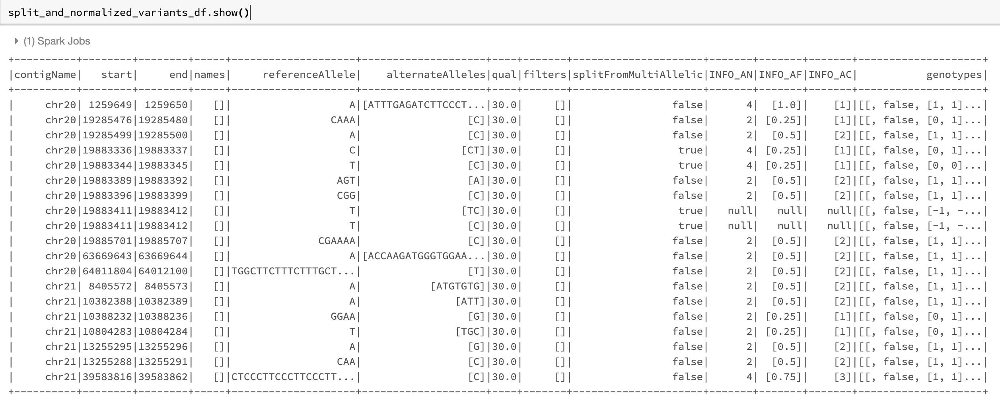

============================================================
Streamlining Variant Normalization on Large Genomic Datasets
============================================================

| Author: `Kiavash Kianfar <https://github.com/kianfar77>`_
| November 20, 2019

Many research and drug development projects in the genomics world involve large genomic variant data sets, the volume of which has been growing exponentially over the past decade. However, the tools to extract, transform, load (ETL) and analyze these data sets have not kept pace with this growth. Single-node command line tools or scripts are very inefficient in handling terabytes of genomics data in these projects. In October of this year, `Databricks <https://databricks.com/>`_ and the `Regeneron Genetics Center <https://www.regeneron.com/genetics-center>`_ partnered to introduce the open-source project `Glow <https://projectglow.io/>`_, which provides powerful genomics tools based on Apache Spark in order to address this issue.

In large cross-team research or drug discovery projects, computational biologists and bioinformaticians usually need to merge very large variant call sets in order to perform downstream analyses. In a `prior post <https://databricks.com/blog/2019/06/26/scaling-genomic-workflows-with-spark-sql-bgen-and-vcf-readers.html>`_, we showcased the power and simplicity of Glow in ETL and merging of variant call sets from different sources using Glow’s VCF and BGEN Data Sources at unprecedented scales. Differently sourced variant call sets impose another major challenge. It is not uncommon for these sets to be generated by different variant calling tools and methods. Consequently, the same genomic variant may be represented differently (in terms of genomic position and alleles) across different call sets. These discrepancies in variant representation must be resolved before any further analysis on the data. This is critical for the following reasons:

1. To avoid incorrect bias in the results of downstream analysis on the merged set of variants or waste of analysis effort on seemingly new variants due to lack of normalization, which are in fact redundant (see Tan et al. for examples of this redundancy in 1000 Genome Project variant calls and dbSNP)
2. To ensure that the merged data set and its post-analysis derivations are compatible and comparable with other public and private variant databases.

This is achieved by what is referred to as variant normalization, a process that ensures the same variant is represented identically across different data sets. Performing variant normalization on terabytes of variant data in large projects using popular single-node tools can become quite a challenge as the acceptable input and output of these tools are the flat file formats that are commonly used to store variant calls (such as VCF and BGEN). To address this issue, we introduced the variant normalization transformation into Glow, which directly acts on a Spark Dataframe of variants to generate a DataFrame of normalized variants, harnessing the power of Spark to normalize variants from hundreds of thousands of samples in a fast and scalable manner with just a single line of Python or Scala code. Before addressing our normalizer, let us have a slightly more technical look at what variant normalization actually does.

What does variant normalization do?
-----------------------------------

Variant normalization ensures that the representation of a variant is both “parsimonious” and “left-aligned.” A variant is parsimonious if it is represented in as few nucleotides as possible without reducing the length of any allele to zero. An example is given in :numref:`figparsimony`.

   Variant parsimony

A variant is left-aligned if its position cannot be shifted to the left while keeping the length of all its alleles the same. An example is given in :numref:`figleftalign`.

   Left-aligned variant

:ref:`Tan et al. <Tan>` have proved that normalization results in uniqueness. In other words, two variants have different normalized representations if and only if they are actually different variants.

Variant normalization in Glow
-----------------------------

We have introduced  the ``normalize_variants`` transformer into Glow (:numref:`figflowchartglow`). After ingesting variant calls into a Spark DataFrame using the VCF, BGEN or Delta readers, a user can call a single line of Python or Scala code to normalize all variants. This generates another DataFrame in which all variants are presented in their normalized form. The normalized DataFrame can then be used for downstream analyses like a GWAS using our `built-in regression functions <https://databricks.com/blog/2019/09/20/engineering-population-scale-genome-wide-association-studies-with-apache-spark-delta-lake-and-mlflow.html>`_ or an `efficiently-parallelized GWAS tool <https://databricks.com/blog/2019/10/02/parallelizing-saige-across-hundreds-of-cores.html>`_.

   Scalable Variant Normalization Using Glow

The ``normalize_variants`` transformer brings unprecedented scalability and simplicity to this important upstream process, hence is yet another reason why Glow and Databricks UAP for Genomics are ideal platforms for biobank-scale genomic analyses, e.g., association studies between genetic variations and diseases across cohorts of hundreds of thousands of individuals.

The underlying normalization algorithm and its accuracy
-------------------------------------------------------

There are several single-node tools for variant normalization that use different normalization algorithms. Widely used tools for variant normalization include `vt normalize <https://genome.sph.umich.edu/wiki/Vt>`_, `bcftools norm <http://www.htslib.org/doc/bcftools.html#norm>`_, and the GATK’s `LeftAlignAndTrimVariants <https://software.broadinstitute.org/gatk/documentation/tooldocs/3.8-0/org_broadinstitute_gatk_tools_walkers_variantutils_LeftAlignAndTrimVariants.php>`_.

Based on our own investigation and also as indicated by :ref:`Bayat et al. <Bayat>` and :ref:`Tan et al. <Tan>`, the GATK’s LeftAlignAndTrimVariants algorithm frequently fails to completely left-align some variants. For example, we noticed that on the `test_left_align_hg38.vcf <https://github.com/broadinstitute/gatk/tree/master/src/test/resources/org/broadinstitute/hellbender/tools/walkers/variantutils/LeftAlignAndTrimVariants>`_ test file from GATK itself, applying LeftAlignAndTrimVariants results in an incorrect normalization of 3 of the 16 variants in the file, including the variants at positions ``chr20:63669973``, ``chr20:64012187``, and ``chr21:13255301``. These variants are normalized correctly using ``vt normalize`` and ``bcftools norm``.

Consequently, in our ``normalize_variants`` transformer, we used an improved version of the ``bcftools norm`` or ``vt normalize`` algorithms, which are similar in fundamentals. For a given variant, we start by right-trimming all the alleles of the variant as long as their rightmost nucleotides are the same. If the length of any allele reaches zero, we left-append it with a fixed block of nucleotides from the reference genome (the nucleotides are added in blocks as opposed to one-by-one to limit the number of referrals to the reference genome). When right-trimming is terminated, a potential left-trimming is performed to eliminate the leftmost nucleotides common to all alleles (possibly generated by prior left-appendings). The start, end, and alleles of the variants are updated appropriately during this process.

We benchmarked the accuracy of our normalization algorithm against ``vt normalize`` and ``bcftools norm`` on multiple test files and validated that our results match the results of these tools.

Optional splitting
------------------

Our ``normalize_variants`` transformer can optionally split multiallelic variants to biallelics. This is controlled by the mode option that can be supplied to this transformer. The possible values for the mode option are as follows: ``normalize`` (default), which performs normalization only, ``split_and_normalize``, which splits multiallelic variants to biallelic ones before performing normalization, and ``split``, which only splits multiallelics without doing any normalization.

The splitting logic of our transformer is the same as the splitting logic followed by GATK’s `LeftAlignAndTrimVariants <https://software.broadinstitute.org/gatk/documentation/tooldocs/3.8-0/org_broadinstitute_gatk_tools_walkers_variantutils_LeftAlignAndTrimVariants.php>`_ tool using ``--splitMultiallelics`` option. More precisely, in case of splitting multiallelic variants loaded from VCF files, this transformer recalculates the ``GT`` blocks for the resulting biallelic variants if possible, and drops all ``INFO`` fields, except for ``AC``, ``AN``, and ``AF``. These three fields are imputed based on the newly calculated ``GT`` blocks, if any exists, otherwise, these fields are dropped as well.

Using the transformer
---------------------

Here, we briefly demonstrate how using Glow very large variant call sets can be normalized and/or split. First, VCF and/or BGEN files can be read into a Spark DataFrame as demonstrated in a `prior post <https://databricks.com/blog/2019/06/26/scaling-genomic-workflows-with-spark-sql-bgen-and-vcf-readers.html>`_. This is shown in Python for the set of VCF files contained in a folder named ``/databricks-datasets/genomics/call-sets``:

.. code-block::

  original_variants_df = spark.read\
    .format("vcf")\
    .option("includeSampleIds", False)\
    .load("/databricks-datasets/genomics/call-sets")

An example of the DataFrame original_variants_df is shown in :numref:`figoriginaldf`.

   The variant DataFrame original_variants_df

The variants can then be normalized using the ``normalize_variants`` transformer as follows:

.. code-block::

  import glow

  ref_genome_path = '/mnt/dbnucleus/dbgenomics/grch38/data/GRCh38.fa'

  normalized_variants_df = glow.transform(\
    "normalize_variants",\
    original_variants_df,\
    reference_genome_path=ref_genome_path\
  )

Note that normalization requires the reference genome ``.fasta`` or ``.fa`` file, which is provided using the ``reference_genome_path`` option. The ``.dict`` and ``.fai`` files must accompany the reference genome file in the same folder (read more about these file formats `here <https://software.broadinstitute.org/gatk/documentation/article?id=11013>`_).

Our example Dataframe after normalization can be seen in :numref:`fignormalizeddf`.

   The ``normalized_variants_df`` DataFrame obtained after applying ``normalize_variants`` transformer on ``original_variants_df``. Notice that several variants are normalized and their start, end, and alleles have changed accordingly.

By default, the transformer normalizes each variant without splitting the  multiallelic variants before normalization as seen in :numref:`fignormalizeddf`. By setting the mode option to ``split_and_normalize``, nothing changes for biallelic variants, but the multiallelic variants are first split to the appropriate number of biallelics and the resulting biallelics are normalized. This can be done as follows:

.. code-block::

  split_and_normalized_variants_df = glow.transform(\
    "normalize_variants",\
    original_variants_df,\
    reference_genome_path=ref_genome_path,\
    mode=“split_and_normalize”
  )

The resulting DataFrame looks like :numref:`figsplitnormalizeddf`.

   The ``split_and_normalized_variants_df`` DataFrame after applying normalize_variants transformer with ``mode=split_and_normalize`` on ``original_variants_df``. Notice that for example the triallelic variant ``chr20,start=19883344,end=19883345,REF=T,ALT=[TT,C]`` of ``original_variants_df`` has been split into two biallelic variants and then normalized resulting in two normalized biallelic variants ``chr20,start=19883336,end=19883337,REF=C,ALT=CT`` and ``chr20,start=19883344,end=19883345,REF=T,ALT=C``.

As mentioned before, the transformer can also be used only for splitting of multiallelics without doing any normalization by setting the mode option to ``split``.

Summary
-------
Using Glow ``normalize_variants`` transformer, computational biologists and bioinformaticians can normalize very large variant datasets of hundreds of thousands of samples in a fast and scalable manner. Differently sourced call sets can be ingested and merged using VCF and/or BGEN readers, normalization can be performed using this transformer in a just a single line of code. The transformer can optionally perform splitting of multiallelic variants to biallelics as well.

Try it!
-------
Our `normalize_variants <https://glow.readthedocs.io/en/latest/tertiary/variant-normalization.html>`_ transformer makes it easy to normalize (and split) large variant datasets with a very small amount of code . Learn more about other feature of Glow `here <https://glow.readthedocs.io/en/latest/index.html>`_.

References
----------
.. _Bayat:

Arash Bayat, Bruno Gaëta, Aleksandar Ignjatovic, Sri Parameswaran, `Improved VCF normalization for accurate VCF comparison <https://academic.oup.com/bioinformatics/article/33/7/964/2623048>`_, Bioinformatics, Volume 33, Issue 7, 2017, Pages 964–970

.. _Tan:

Adrian Tan, Gonçalo R. Abecasis, Hyun Min Kang, `Unified representation of genetic variants <https://academic.oup.com/bioinformatics/article/31/13/2202/196142>`_, Bioinformatics, Volume 31, Issue 13, 2015, Pages 2202–2204
