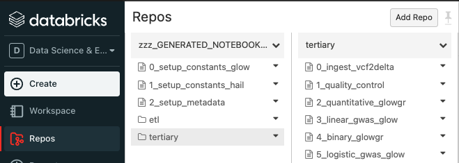
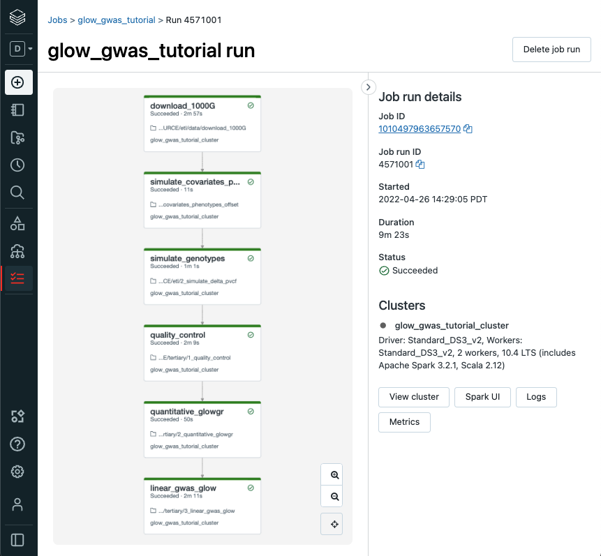

Getting Started
===============

Running Locally
---------------

<<<<<<< HEAD
Glow requires Apache Spark 3.4 or 3.5.
=======
Glow requires Apache Spark 3.1.2.
>>>>>>> f6791fc (Fetch upstream)

.. tabs::

    .. tab:: Python

        If you don't have a local Apache Spark installation, you can install it from PyPI:

        .. code-block:: sh

<<<<<<< HEAD
          pip install pyspark==3.5.0
=======
          pip install pyspark==3.1.2
>>>>>>> f6791fc (Fetch upstream)

        or `download a specific distribution <https://spark.apache.org/downloads.html>`_.

        Install the Python frontend from pip:

        .. code-block:: sh

          pip install glow.py

        and then start the `Spark shell <http://spark.apache.org/docs/latest/rdd-programming-guide.html#using-the-shell>`_
        with the Glow maven package:

        .. code-block:: sh
          :substitutions:

          ./bin/pyspark --packages io.projectglow:glow-spark3_2.12:|mvn-version| --conf spark.hadoop.io.compression.codecs=io.projectglow.sql.util.BGZFCodec

        To start a Jupyter notebook instead of a shell:

        .. code-block:: sh
          :substitutions:

          PYSPARK_DRIVER_PYTHON=jupyter PYSPARK_DRIVER_PYTHON_OPTS=notebook ./bin/pyspark --packages io.projectglow:glow-spark3_2.12:|mvn-version| --conf spark.hadoop.io.compression.codecs=io.projectglow.sql.util.BGZFCodec

        And now your notebook is glowing! To access the Glow functions, you need to register them with the
        Spark session.

        .. invisible-code-block: python

          path = 'test-data/tabix-test-vcf/NA12878_21_10002403.vcf.gz'

        .. code-block:: python

          import glow
          spark = glow.register(spark)
          df = spark.read.format('vcf').load(path)

    .. tab:: Scala

        If you don't have a local Apache Spark installation,
        `download a specific distribution <https://spark.apache.org/downloads.html>`_.

        Start the `Spark shell <http://spark.apache.org/docs/latest/rdd-programming-guide.html#using-the-shell>`_
        with the Glow maven package:

        .. code-block:: sh
          :substitutions:

          ./bin/spark-shell --packages io.projectglow:glow-spark3_2.12:|mvn-version| --conf spark.hadoop.io.compression.codecs=io.projectglow.sql.util.BGZFCodec

        To access the Glow functions, you need to register them with the Spark session.

        .. code-block:: scala

          import io.projectglow.Glow
          val sess = Glow.register(spark)
          val df = sess.read.format("vcf").load(path)

Getting started on Databricks
-----------------------------

Databricks makes it simple to run Glow on Amazon Web Services (AWS), Microsoft Azure, and Google Cloud Platform (GCP).

You can install the Glow Scala and Python artifacts as `Maven and PyPI cluster libraries <https://docs.databricks.com/en/libraries/cluster-libraries.html>`_.

After you've set up a cluster and installed Glow, you can follow these steps to see how it works:

1. Sync the Glow notebooks via Repos

   #. Fork the `Glow github repo <https://github.com/projectglow/glow>`_.
   #. Clone your fork to your Databricks workspace using Repos (step-by-step `guide <https://docs.databricks.com/repos/sync-remote-repo.html>`_).
   #. The notebooks are located under ``docs/source/_static``.

2. Create automated jobs

To build an automated Glow workflow in your Databricks workspace, please follow these steps, which :ref:`simulate data <data_simulation>` and then run the Glow :ref:`GWAS tutorial <gwas_tutorial>`

1. Configure the Databricks CLI, authenticating via Databricks personal access token (`docs <https://docs.databricks.com/dev-tools/cli/index.html>`_).
2. Create a directory in your Databricks workspace,

.. code-block:: sh

   databricks workspace mkdirs /Repos/test

3. Import source files from your fork of the Glow Github repository to this directory using repos,

.. code-block:: sh

   databricks repos create --url https://github.com/<github_profile>/glow --provider gitHub --path /Repos/test/glow

4. Switch to the branch of Glow that you are working on using repos,

.. code-block:: sh
   
   databricks repos update --branch master --path /Repos/test/glow

5. Create a workflow using jobs,

  - Azure GWAS tutorial

  .. code-block:: sh
  
     databricks jobs create --json-file docs/dev/glow-gwas-tutorial-azure.json

  - AWS GWAS tutorial

  .. code-block:: sh
  
     databricks jobs create --json-file docs/dev/glow-gwas-tutorial-aws.json

6. Take the job id that is returned, and run the job,

.. code-block:: sh
   
   databricks jobs run-now --job-id <job id>

7. Go to the Databricks web application and view the output of the job,

8. Epilogue

The full set of notebooks in Glow undergo nightly integration testing orchestrated by CircleCI (`example output <https://app.circleci.com/pipelines/github/projectglow/glow/3050/workflows/c8a47149-2dae-406e-8e0c-cbaf21de715c/jobs/9424>`_) using the latest version of the Glow Docker container on Databricks. CircleCI kicks off these notebooks from the Databricks command line interface (CLI) via a python `script <https://github.com/projectglow/glow/blob/master/docs/dev/run-nb-test.py>`_, which contains the above steps. The workflow is defined in this configuration `json <https://github.com/projectglow/glow/blob/master/docs/dev/multitask-integration-test-config.json>`_ template. And the output is shown below. You can adapt these as you build your own production jobs.

.. image:: _static/images/glow_ci_pipeline.png

.. important::

   These notebooks must be run in order!

As you build out your pipelines please consider the following points,

.. important::

   - Start small. Experiment on individual variants, samples or chromosomes.
   - Steps in your pipeline might require different cluster configurations.

.. tip::

   - Use compute-optimized virtual machines to read variant data from cloud object stores.
   - Use Delta Cache accelerated virtual machines to query variant data.
   - Use memory-optimized virtual machines for genetic association studies.
   - The Glow Pipe Transformer supports parallelization of deep learning tools that run on GPUs.

Notebooks embedded in the docs
------------------------------

<<<<<<< HEAD
<<<<<<< HEAD
<<<<<<< HEAD
=======
>>>>>>> 5dd84bd (update hail)
Documentation pages are accompanied by embedded notebook examples. Most code in these notebooks can be run on Spark and Glow alone, but functions such as ``display()`` or ``dbutils()`` are only available on Databricks. See :ref:`dbnotebooks` for more info.

These notebooks are located in the Glow github repository `here <https://github.com/projectglow/glow/blob/master/docs/source/_static/zzz_GENERATED_NOTEBOOK_SOURCE/>`_ and are tested nightly end-to-end. They include notebooks to define constants such as the number of samples to simulate and the output paths for each step in the pipeline. Notebooks that define constants are ``%run`` at the start of each notebook in the documentation. Please see :ref:`data_simulation` to get started.
=======
To demonstrate example use cases of Glow functionalities, most doc pages are accompanied by embedded notebooks. Most of the code in these notebooks can be run on Spark and Glow alone, but a few functions such as ``display()`` or ``dbutils()`` are only available on Databricks. See :ref:`dbnotebooks` for more info.
<<<<<<< HEAD
=======
Documentation pages are accompanied by embedded notebook examples. Most code in these notebooks can be run on Spark and Glow alone, but functions such as ``display()`` or ``dbutils()`` are only available on Databricks. See :ref:`dbnotebooks` for more info.
>>>>>>> f6791fc (Fetch upstream)

These notebooks are located in the Glow github repository `here <https://github.com/projectglow/glow/blob/master/docs/source/_static/zzz_GENERATED_NOTEBOOK_SOURCE/>`_ and are tested nightly end-to-end.  They include notebooks to define constants such as the number of samples to simulate and the output paths for each step in the pipeline. Notebooks that define constants are ``%run`` at the start of each notebook in the documentation. Please see :ref:`data_simulation` to get started.
=======

Also note that the path to datasets used as example in these notebooks is usually a folder in ``/databricks-datasets/genomics/`` and should be replaced with the appropriate path based on your own folder structure.
>>>>>>> 5dd84bd (update hail)

Getting started on Databricks
-----------------------------

<<<<<<< HEAD
The Databricks documentation shows how to get started with Glow on, 

  - **Amazon Web Services** (AWS - `docs <https://docs.databricks.com/applications/genomics/tertiary-analytics/glow.html>`_)
  - **Microsoft Azure** (`docs <https://docs.microsoft.com/en-us/azure/databricks/applications/genomics/tertiary-analytics/glow>`_) 
  - **Google Cloud Platform** (GCP - `docs <https://docs.gcp.databricks.com/applications/genomics/tertiary-analytics/glow.html>`_)

 
Getting started on other cloud services
---------------------------------------

<<<<<<< HEAD
Please submit a pull request to add a how-to guide for other cloud services.
>>>>>>> fc749e2 (update hail)
=======
Please submit a pull request to add a guide for other cloud services.
>>>>>>> f6791fc (Fetch upstream)
=======
The following series of notebooks showcase how to get started with Glow on Databricks on Amazon Web Services and Microsoft Azure.

*coming soon: Google Cloud Platform*

.. notebook:: . readme/index.html
  :title: Databricks quickstart guide

Getting started on other cloud services
---------------------------------------

Please submit a pull request to add a how-to guide for other cloud services.
>>>>>>> fc749e2 (update hail)
>>>>>>> 5dd84bd (update hail)
