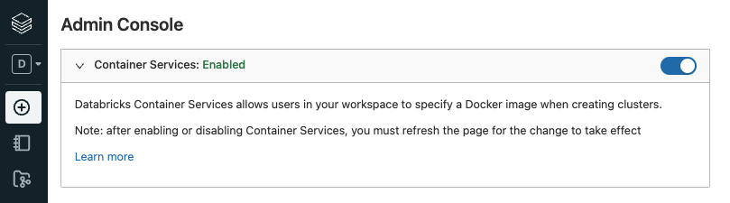
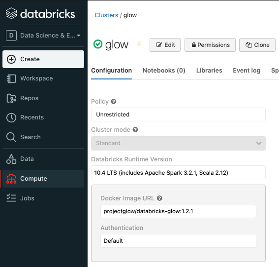
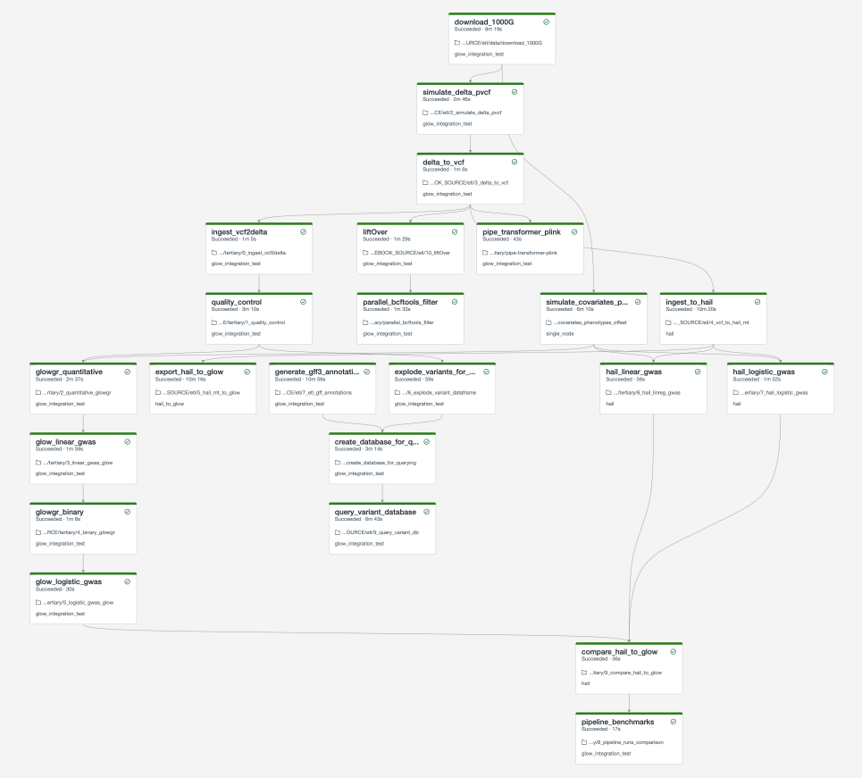

Getting Started
===============

Running Locally
---------------

Glow requires Apache Spark 3.2.1.

.. tabs::

    .. tab:: Python

        If you don't have a local Apache Spark installation, you can install it from PyPI:

        .. code-block:: sh

          pip install pyspark==3.2.1

        or `download a specific distribution <https://spark.apache.org/downloads.html>`_.

        Install the Python frontend from pip:

        .. code-block:: sh

          pip install glow.py

        and then start the `Spark shell <http://spark.apache.org/docs/latest/rdd-programming-guide.html#using-the-shell>`_
        with the Glow maven package:

        .. code-block:: sh
          :substitutions:

          ./bin/pyspark --packages io.projectglow:glow-spark3_2.12:|mvn-version| --conf spark.hadoop.io.compression.codecs=io.projectglow.sql.util.BGZFCodec

        To start a Jupyter notebook instead of a shell:

        .. code-block:: sh
          :substitutions:

          PYSPARK_DRIVER_PYTHON=jupyter PYSPARK_DRIVER_PYTHON_OPTS=notebook ./bin/pyspark --packages io.projectglow:glow-spark3_2.12:|mvn-version| --conf spark.hadoop.io.compression.codecs=io.projectglow.sql.util.BGZFCodec

        And now your notebook is glowing! To access the Glow functions, you need to register them with the
        Spark session.

        .. invisible-code-block: python

          path = 'test-data/tabix-test-vcf/NA12878_21_10002403.vcf.gz'

        .. code-block:: python

          import glow
          spark = glow.register(spark)
          df = spark.read.format('vcf').load(path)

    .. tab:: Scala

        If you don't have a local Apache Spark installation,
        `download a specific distribution <https://spark.apache.org/downloads.html>`_.

        Start the `Spark shell <http://spark.apache.org/docs/latest/rdd-programming-guide.html#using-the-shell>`_
        with the Glow maven package:

        .. code-block:: sh
          :substitutions:

          ./bin/spark-shell --packages io.projectglow:glow-spark3_2.12:|mvn-version| --conf spark.hadoop.io.compression.codecs=io.projectglow.sql.util.BGZFCodec

        To access the Glow functions, you need to register them with the Spark session.

        .. code-block:: scala

          import io.projectglow.Glow
          val sess = Glow.register(spark)
          val df = sess.read.format("vcf").load(path)

Getting started on Databricks
-----------------------------

Databricks makes it simple to run Glow on Amazon Web Services (AWS), Microsoft Azure, and Google Cloud Platform (GCP). 

To spin up a cluster with Glow, please use the `Databricks Glow docker container <https://hub.docker.com/r/projectglow/databricks-glow>`_ to manage the environment. 
This container includes `genomics libraries <https://github.com/projectglow/glow/blob/master/docker/databricks/dbr/dbr10.4/genomics/Dockerfile>`_ that complement Glow.
This container can be installed via Databricks container services. 

Here is how to set it up on the Databricks web application,

1. Have your Databricks administrator enable container services via ``Settings -> Admin Console``

2. Go to ``Compute -> Create Cluster`` and configure the cluster as follows,

.. important:: Please use the ``projectglow/databricks-glow:<tag>`` Docker Image URL, replacing <tag> with the latest version of Glow on the Project Glow `Dockerhub page <https://hub.docker.com/r/projectglow/databricks-glow/tags>`_. Then match the version of Glow to a version of the Databricks Runtime that includes the same version of Spark. For example, Glow `v1.2.1 <https://github.com/projectglow/glow/releases/tag/v1.2.1>`_ and Databricks Runtime `10.4 Long Term Support (LTS) <https://docs.databricks.com/release-notes/runtime/releases.html>`_ are both built on ``Spark 3.2.1``. Use LTS runtimes where available, ``10.4 LTS`` will be supported until Mar 18, 2024.

3. Sync the Glow notebooks via Repos

   #. Fork the `Glow github repo <https://github.com/projectglow/glow>`_.
   #. Clone your fork to your Databricks workspace using Repos (step-by-step `guide <https://docs.databricks.com/repos/index.html#clone-a-remote-git-repository>`_).
   #. The notebooks are located under ``docs/source/_static``.

4. Create automated jobs

To build an automated Glow workflow in your Databricks workspace, please follow these steps, which :ref:`simulate data <data_simulation>` and then run the Glow :ref:`GWAS tutorial <gwas_tutorial>`

1. Configure the Databricks CLI, authenticating via Databricks personal access token (`docs <https://docs.databricks.com/dev-tools/cli/index.html>`_).
2. Create a directory in your Databricks workspace,

.. code-block:: sh

   databricks workspace mkdirs /Repos/test

3. Import source files from your fork of the Glow Github repository to this directory using repos,

.. code-block:: sh

   databricks repos create --url https://github.com/<github_profile>/glow --provider gitHub --path /Repos/test/glow

4. Switch to the branch of Glow that you are working on using repos,

.. code-block:: sh
   
   databricks repos update --branch master --path /Repos/test/glow

5. Create a workflow using jobs,
  - Azure GWAS tutorial
  .. code-block:: sh
  
     databricks jobs create --json-file docs/dev/glow-gwas-tutorial-azure.json

  - AWS GWAS tutorial
  .. code-block:: sh
  
     databricks jobs create --json-file docs/dev/glow-gwas-tutorial-aws.json

6. Take the job id that is returned, and run the job,

.. code-block:: sh
   
   databricks jobs run-now --job-id <job id>

7. Go to the Databricks web application and view the output of the job,

8. Epilogue

The full set of notebooks in Glow undergo nightly integration testing orchestrated by CircleCI (`example output <https://app.circleci.com/pipelines/github/projectglow/glow/3050/workflows/c8a47149-2dae-406e-8e0c-cbaf21de715c/jobs/9424>`_) using the latest version of the Glow Docker container on Databricks. CircleCI kicks off these notebooks from the Databricks command line interface (CLI) via a python `script <https://github.com/projectglow/glow/blob/master/docs/dev/run-nb-test.py>`_, which contains the above steps. The workflow is defined in this configuration `json <https://github.com/projectglow/glow/blob/master/docs/dev/multitask-integration-test-config.json>`_ template. And the output is shown below. You can adapt these as you build your own production jobs.

.. important::

   These notebooks must be run in order!

As you build out your pipelines please consider the following points,

.. important::

   - Start small. Experiment on individual variants, samples or chromosomes.
   - Steps in your pipeline might require different cluster configurations.

.. tip::

   - Use compute-optimized virtual machines to read variant data from cloud object stores.
   - Use Delta Cache accelerated virtual machines to query variant data.
   - Use memory-optimized virtual machines for genetic association studies.
   - The Glow Pipe Transformer supports parallelization of deep learning tools that run on GPUs.

Getting started on other cloud services
---------------------------------------

Glow is packaged into a Docker container based on an image from `data mechanics <https://hub.docker.com/r/datamechanics/spark>`_ that can be run locally and that also includes connectors to Azure Data Lake, Google Cloud Storage, Amazon Web Services S3, Snowflake, and `Delta Lake <https://docs.delta.io/latest/index.html>`_. This container can be installed using the ``projectglow/open-source-glow:<tag>`` Docker Image URL, replacing <tag> with the latest version of Glow.

This container can be used or adapted to run Glow outside of Databricks (`source code <https://github.com/projectglow/glow/tree/master/docker>`_).
And was contributed by Edoardo Giacopuzzi (``edoardo.giacopuzzi at fht.org``) from Human Technopole.

Please submit a pull request to add guides for specific cloud services.

Notebooks embedded in the docs
------------------------------

Documentation pages are accompanied by embedded notebook examples. Most code in these notebooks can be run on Spark and Glow alone, but functions such as ``display()`` or ``dbutils()`` are only available on Databricks. See :ref:`dbnotebooks` for more info.

These notebooks are located in the Glow github repository `here <https://github.com/projectglow/glow/blob/master/docs/source/_static/zzz_GENERATED_NOTEBOOK_SOURCE/>`_ and are tested nightly end-to-end. They include notebooks to define constants such as the number of samples to simulate and the output paths for each step in the pipeline. Notebooks that define constants are ``%run`` at the start of each notebook in the documentation. Please see :ref:`data_simulation` to get started.
