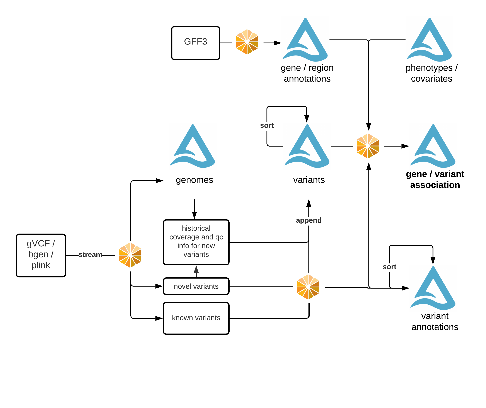

Introduction to Glow
====================

Genomics data has been doubling every seven months globally. It has now reached a scale where genomics has 
become a big data problem. However, most of the tools for working with genomics data are built to work on 
single nodes and will not scale. Furthermore, it has become challenging for scientists to manage storage 
of public data.

Glow solves these problems by bridging bioinformatics and the big data ecosystem. It enables bioinformaticians 
and computational biologists to leverage best practices used by data engineers and data scientists across industry.

Under the hood, Glow is built on `Apache Spark <https://spark.apache.org/docs/latest/api/python/index.html>`_ and `Delta Lake <https://delta.io/>`_,
enabling distributed computation on and distributed storage of genotype data. The library is backwards compatible 
with genomics file formats and bioinformatics tools developed in academia, enabling users to easily share data 
with collaborators.

Glow is used to:

- Ingest public genotype data into a data lake that acts as a single source of truth.
- Run quality control, statistical analysis, and  association studies on population-scale datasets.
- Build reproducible, production-grade genomics data pipelines that will scale to petabytes and beyond.

Glow features:

- Genomic datasources: To read datasets in common file formats such as VCF, BGEN, and Plink into Spark DataFrames.
- Genomic functions: Common operations such as computing quality control statistics, running regression
  tests, and performing simple transformations are provided as Spark functions that can be
  called from Python, SQL, Scala, or R.
- Data preparation building blocks: Glow includes transformations such as variant normalization and
  lift over to help produce analysis ready datasets.
- Integration with existing tools: With Spark, you can write user-defined functions (UDFs) in
  Python, R, SQL, or Scala. Glow also makes it easy to run DataFrames through command line tools.
- Integration with other data types: Genomic data can generate additional insights when joined with data sets
  such as electronic health records, real world evidence, and medical images. Since Glow returns native Spark
  SQL DataFrames, its simple to join multiple data sets together.
