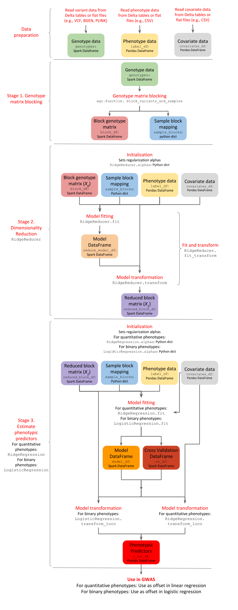

.. _glowgr:

===============================
GloWGR: Whole Genome Regression
===============================

.. invisible-code-block: python

    import glow

    genotypes_vcf = 'test-data/gwas/genotypes.vcf.gz'
    covariates_csv = 'test-data/gwas/covariates.csv.gz'
    continuous_phenotypes_csv = 'test-data/gwas/continuous-phenotypes.csv.gz'
    binary_phenotypes_csv = 'test-data/gwas/binary-phenotypes.csv.gz'

Glow supports Whole Genome Regression (WGR) as GloWGR, a distributed version of the `regenie <https://rgcgithub.github.io/regenie/>`_ method (see the paper published in `Nature Genetics <https://www.nature.com/articles/s41588-021-00870-7>`_). GloWGR supports two types of phenotypes:

- Quantitative 
- Binary

Many steps of the GloWGR workflow explained in this page are common between the two cases. Any step that is different between the two has separate explanations clearly marked by "for quantitative phenotypes" vs. "for binary phenotypes".

-----------
Performance
-----------

The following figure demonstrates the performance gain obtained by using parallelized GloWGR in comparision with single machine BOLT, fastGWA GRM, and regenie for fitting WGR models against 50 quantitative phenotypes from the UK Biobank project.

.. image:: ../_static/images/wgr_runtime.png
   :scale: 50 %

.. TODO: Add a picture for binary

--------
Overview
--------

GloWGR consists of the following stages:

- Block the genotype matrix across samples and variants
- Perform dimensionality reduction with linear ridge regression
- Estimate phenotypic predictors using

  - **For quantitative phenotypes**: linear ridge regression
  - **For binary phenotypes**: logistic ridge regression

The following diagram provides an overview of the operations and data within the stages of GlowWGR and their interrelationship.

----------------
Data preparation
----------------

GloWGR accepts three input data components.

.. _genotype-data:

1. Genotype data
================

The genotype data may be read as a Spark DataFrame from any variant data source supported by Glow, such as :ref:`VCF, BGEN or PLINK <variant_data>`. For scalability and high-performance repeated use, we recommend storing flat genotype files into :ref:`Delta tables <vcf2delta>`.
The DataFrame must include a column ``values`` containing a numeric representation of each genotype. The genotypic values may not be missing.

When loading the variants into the DataFrame, perform the following transformations:

- Split multiallelic variants with the ``split_multiallelics`` transformer.
- Create a ``values`` column by calculating the numeric representation of each genotype. This representation is typically the number of alternate alleles for biallelic variants which can be calculated with ``glow.genotype_states``. Replace any missing values with the mean of the non-missing values using ``glow.mean_substitute``.

Example
-------

.. code-block:: python

    from pyspark.sql.functions import col, lit

    variants = spark.read.format('vcf').load(genotypes_vcf)
    genotypes = variants.withColumn('values', glow.mean_substitute(glow.genotype_states(col('genotypes'))))

2. Phenotype data
=================

The phenotype data is represented as a Pandas DataFrame indexed by the sample ID. Phenotypes are also referred to as labels. Each column represents a single phenotype. It is assumed that there are no missing phenotype values.

- **For quantitative phenotypes:** It is assumed the phenotypes are standardized with zero mean and unit (unbiased) variance.

  **Example:** Standardization can be performed with Pandas or `scikit-learn's StandardScaler <https://scikit-learn.org/stable/modules/generated/sklearn.preprocessing.StandardScaler.html>`_.

  .. code-block:: python

    import pandas as pd
    label_df = pd.read_csv(continuous_phenotypes_csv, index_col='sample_id')[['Continuous_Trait_1', 'Continuous_Trait_2']]

- **For binary phenotypes:** Phenotype values are either 0 or 1. No standardization is needed.

  **Example**

  ::

    import pandas as pd
    label_df = pd.read_csv(binary_phenotypes_csv, index_col='sample_id')

3. Covariate data
=================

The covariate data is represented as a Pandas DataFrame indexed by the sample ID. Each column represents a single covariate. It is assumed that there are no missing covariate values, and that the covariates are standardized with zero mean and unit (unbiased) variance.

Example
-------

.. code-block:: python

    covariate_df = pd.read_csv(covariates_csv, index_col='sample_id')

---------------------------------
Stage 1. Genotype matrix blocking
---------------------------------
The first stage of GloWGR is to generate the block genotype matrix. The ``glow.wgr.functions.block_variants_and_samples`` function is used for this purpose and creates two objects: a block genotype matrix and a sample block mapping.

.. warning::
    We do not recommend using the ``split_multiallelics`` transformer and the ``block_variants_and_samples`` function
    in the same query due to JVM JIT code size limits during whole-stage code generation. It is best to persist the
    variants after splitting multiallelics to a Delta table (see :ref:`vcf2delta`) and then read the data from
    this Delta table to apply ``block_variants_and_samples``.

Parameters
==========

- ``genotypes``: Genotype DataFrame including the ``values`` column generated as explained :ref:`above <genotype-data>`
- ``sample_ids``: A python List of sample IDs. Can be created by applying ``glow.wgr.functions.get_sample_ids`` to a genotype
  DataFrame
- ``variants_per_block``: Number of variants to include in each block. We recommend 1000.
- ``sample_block_count``: Number of sample blocks to create. We recommend 10.

Return
======

The function returns a block genotype matrix and a sample block mapping.

    - **Block genotype matrix** (see figure below): The block genotype matrix can be conceptually imagined as an :math:`N \times M` matrix :math:`X` where each row represents an individual sample, and each column represents a variant, and each cell :math:`(i, j)` contains the genotype value for sample :math:`i` at variant :math:`j`.  Then imagine a coarse grid is laid on top of matrix :math:`X` such that matrix cells within the same coarse grid cell are all assigned to the same block. Each block :math:`x` is indexed by a sample block ID (corresponding to a list of rows belonging to the block) and a header block ID (corresponding to a list of columns belonging to the block). The sample block IDs are generally just integers 0 through the number of sample blocks. The header block IDs are strings of the form 'chr_C_block_B', which refers to the Bth block on chromosome C. The Spark DataFrame representing this block matrix can be thought of as the transpose of each block, i.e., :math:`x^T`, all stacked one atop another. Each row in the DataFrame represents the values from a particular column of :math:`X` for the samples corresponding to a particular sample block.

    .. image:: ../_static/images/blockmatrix.png

    The fields in the DataFrame and their content for a given row are as follows:

        - ``sample_block``: An ID assigned to the block :math:`x` containing the group of samples represented on this row
        - ``header_block``: An ID assigned to the block :math:`x` containing this header
        - ``header``: The column name in the conceptual genotype matrix :math:`X`
        - ``size``: The number of individuals in the sample block
        - ``values``: Genotype values for the header in this sample block.  If the matrix is sparse, contains only non-zero values.
        - ``position``: An integer assigned to this header that specifies the correct sort order for the headers in this block
        - ``mu``: The mean of the genotype values for this header
        - ``sig``: The standard deviation of the genotype values for this header

     .. warning::

        Variant rows in the input DataFrame whose genotype values are uniform across all samples are filtered from the
        output block genotype matrix.

    - **Sample block mapping**: The sample block mapping is a python dictionary containing key-value pairs, where each key is a sample block ID and each value is a list of sample IDs contained in that sample block. The order of these IDs match the order of the ``values`` arrays in the block genotype DataFrame.

Example
=======

.. code-block:: python

    from glow.wgr import RidgeReduction, RidgeRegression, LogisticRidgeRegression, block_variants_and_samples, get_sample_ids
    from pyspark.sql.functions import col, lit

    variants_per_block = 1000
    sample_block_count = 10
    sample_ids = get_sample_ids(genotypes)
    block_df, sample_blocks = block_variants_and_samples(
        genotypes, sample_ids, variants_per_block, sample_block_count)

---------------------------------
Stage 2. Dimensionality reduction
---------------------------------

Having the block genotype matrix, the first stage is to apply a dimensionality reduction to the block matrix :math:`X` using the ``RidgeReducer``. After ``RidgeReducer`` is initialized, dimensionality reduction is accomplished within two steps:

1. Model fitting, performed by the ``RidgeReducer.fit`` function, which fits multiple ridge models within each block :math:`x`.
2. Model transformation, performed by the  ``RidgeReducer.transform`` function, which produces a new block matrix where each column represents the prediction of one ridge model applied within one block.

This approach to model building is generally referred to as **stacking**. We call the starting block genotype matrix the **level 0** matrix in the stack, denoted by :math:`X_0`, and the output of the ridge reduction step the **level 1** matrix, denoted by :math:`X_1`. The ``RidgeReducer`` class is initialized with a list of ridge regularization values (here referred to as alpha). Since ridge models are indexed by these alpha values, the ``RidgeReducer`` will generate one ridge model per value of alpha provided, which in turn will produce one column per block in :math:`X_0`. Therefore, the final dimensions of :math:`X_1` for a single phenotype will be :math:`N \times (L \times K)`, where :math:`L` is the number of header blocks in :math:`X_0` and :math:`K` is the number of alpha values provided to the ``RidgeReducer``. In practice, we can estimate a span of alpha values in a reasonable order of magnitude based on guesses at the heritability of the phenotype we are fitting.

1. Initialization
=================

When the ``RidgeReducer`` is initialized, it assigns names to the provided alphas and stores them in a python dictionary accessible as ``RidgeReducer.alphas``. If alpha values are not provided, they will be generated during ``RidgeReducer.fit`` based on the number of unique headers in the blocked genotype matrix :math:`X_0`, denoted by :math:`h_0`, and a set of heritability values. More specifically,

.. math::

    \alpha = h_0\big[\frac{1}{0.99}, \frac{1}{0.75}, \frac{1}{0.50}, \frac{1}{0.25}, \frac{1}{0.01}\big]

These values are only sensible if the phenotypes are on the scale of one.

Example
-------

.. code-block:: python

    reduction = RidgeReduction(block_df, label_df, sample_blocks, covariate_df)

.. _ridge_reducer_model_fitting:

2. Model fitting
================

The reduction of a block :math:`x_0` from :math:`X_0` to the corresponding block :math:`x_1` from :math:`X_1` is accomplished by the matrix multiplication :math:`x_0 B = x_1`, where :math:`B` is a coefficient matrix of size :math:`m \times K`, where :math:`m` is the number of columns in block :math:`x_0` and :math:`K` is the number of alpha values used in the reduction. As an added wrinkle, if the ridge reduction is being performed against multiple phenotypes at once, each phenotype will have its own :math:`B`, and for convenience we panel these next to each other in the output into a single matrix, so :math:`B` in that case has dimensions :math:`m \times (K \times P)` where :math:`P` is the number of phenotypes. Each matrix :math:`B` is specific to a particular block in :math:`X_0`, so the Spark DataFrame produced by the ``RidgeReducer`` can be thought of matrices :math:`B` from all the blocks, one stacked atop another.

Parameters
----------

- ``block_df``: Spark DataFrame representing the beginning block matrix
- ``label_df``: Pandas DataFrame containing the target labels used in fitting the ridge models
- ``sample_blocks``: Dictionary containing a mapping of sample block IDs to a list of corresponding sample IDs
- ``covariate_df``: Pandas DataFrame containing covariates to be included in every model in the stacking
  ensemble (optional)

.. _model_df:

Return
------

The fields in the model DataFrame are:

- ``header_block``: An ID assigned to the block :math:`x_0` to the coefficients in this row
- ``sample_block``: An ID assigned to the block :math:`x_0` containing the group of samples represented on this row
- ``header``: The column name in the conceptual genotype matrix :math:`X_0` that corresponds to a particular row in the coefficient matrix :math:`B`
- ``alphas``: List of alpha names corresponding to the columns of :math:`B`
- ``labels``: List of labels (i.e., phenotypes) corresponding to the columns of :math:`B`
- ``coefficients``: List of the actual values from a row in :math:`B`

Example
-------

.. code-block:: python

    model_df = reduction.fit()

3. Model transformation
=======================

After fitting, the ``RidgeReducer.transform`` method can be used to generate :math:`X_1` from :math:`X_0`.

Parameters
----------

- ``block_df``: Spark DataFrame representing the beginning block matrix
- ``label_df``: Pandas DataFrame containing the target labels used in fitting the ridge models
- ``sample_blocks``: Dictionary containing a mapping of sample block IDs to a list of corresponding sample IDs
- ``model_df``: Spark DataFrame produced by the ``RidgeReducer.fit`` function, representing the reducer model
- ``covariate_df``: Pandas DataFrame containing covariates to be included in every model in the stacking
  ensemble (optional).

Return
------

The output of the transformation is analogous to the block matrix DataFrame we started with.  The main difference is that, rather than representing a single block matrix, it represents multiple block matrices, with one such matrix per label (phenotype).  The schema of this block matrix DataFrame (``reduced_block_df``) will be as follows:

.. code-block::

     |-- header: string (nullable = true)
     |-- size: integer (nullable = true)
     |-- values: array (nullable = true)
     |    |-- element: double (containsNull = true)
     |-- header_block: string (nullable = true)
     |-- sample_block: string (nullable = true)
     |-- sort_key: integer (nullable = true)
     |-- mu: double (nullable = true)
     |-- sig: double (nullable = true)
     |-- alpha: string (nullable = true)
     |-- label: string (nullable = true)

This schema is the same as the schema of the DataFrame we started with (``block_df``) with two additional columns:

- ``alpha``: Name of the alpha value used in fitting the model that produced the values in this row
- ``label``: The label corresponding to the values in this row.  Since the genotype block matrix :math:`X_0` is phenotype-agnostic, the rows in ``block_df`` were not restricted to any label (phenotype), but the level 1 block matrix :math:`X_1` represents ridge model predictions for the labels the reducer was fit with, so each row is associated with a specific label.

The headers in the :math:`X_1` block matrix are derived from a combination of the source block in :math:`X_0`, the alpha value used in fitting the ridge model, and the label they were fit with. These headers are assigned to header blocks that correspond to the chromosome of the source block in :math:`X_0`.

Example
-------

.. code-block:: python

    reduced_block_df = reduction.transform()

Performing fit and transform in a single step
=============================================

If the block genotype matrix, phenotype DataFrame, sample block mapping, and covariates are constant for both the model fitting and transformation, the ``RidgeReducer.fit_transform`` function can be used to do fit and transform in a single step

Example
-------

::

    reduced_block_df = reduction.fit_transform()

---------------------------------------
Stage 3. Estimate phenotypic predictors
---------------------------------------

At this stage, the block matrix :math:`X_1` is used to fit a final predictive model that can generate phenotype predictions :math:`\hat{y}` using

- **For quantitative phenotypes:** the ``RidgeRegression`` class.
- **For binary phenotypes:** the ``LogisticRegression`` class.

.. _stage_3_initialization:

1. Initialization
=================

- **For quantitative phenotypes:** As with the ``RidgeReducer`` class, the ``RidgeRegression`` class is initialized with a list of alpha values. If alpha values are not provided, they will be generated during ``RidgeRegression.fit`` based on the unique number of headers in the blocked matrix :math:`X_1`, denoted by :math:`h_1`, and a set of heritability values.

 .. math::

     \alpha = h_1\big[\frac{1}{0.99}, \frac{1}{0.75}, \frac{1}{0.50}, \frac{1}{0.25}, \frac{1}{0.01}\big]

 These values are only sensible if the phenotypes are on the scale of one.

 **Example**

 .. code-block:: python

     regression = RidgeRegression.from_ridge_reduction(reduction)

- **For binary phenotypes:** Everything is the same except that ``LogisticRegression`` class is used instead of ``RidgeRegression``.

 **Example**

 ::

     regression = LogisticRidgeRegression.from_ridge_reduction(reduction)

2. Model fitting
================
Model fitting is performed using

- **For quantitative phenotypes:** the ``RidgeRegression.fit`` function.
- **For binary phenotypes:** the ``LogisticRegression.fit`` function.

This works much in the same way as the ``RidgeReducer`` :ref:`model fitting <ridge_reducer_model_fitting>`, except that it returns an additional DataFrame that reports the cross validation results in optimizing the hyperparameter alpha.

Parameters
----------
- ``block_df``: Spark DataFrame representing the reduced block matrix
- ``label_df``: Pandas DataFrame containing the target labels used in fitting the ridge models
- ``sample_blocks``: Dictionary containing a mapping of sample block IDs to a list of corresponding sample IDs
- ``covariate_df``: Pandas DataFrame containing covariates to be included in every model in the stacking
  ensemble (optional)

Return
------

The first output is a model DataFrame analogous to the :ref:`model DataFrame <model_df>` provided by the ``RidgeReducer``.  An important    difference is that the header block ID for all rows will be 'all', indicating that all headers from all blocks have been used in a single fit, rather than fitting within blocks.

The second output is a cross validation report DataFrame containing the results of the hyperparameter (i.e., alpha) value optimization routine. The fields in this DataFrame are:

- ``label``: This is the label corresponding to the cross cv results on the row.
- ``alpha``: The name of the optimal alpha value
- ``r2_mean``: The mean out of fold r2 score for the optimal alpha value

Example
-------
Assuming ``regression`` is initialized to ``RidgeRegression`` (for quantitative phenotypes) or ``LogisticRegression`` (for binary phenotypes) as described :ref:`above <stage_3_initialization>`, fitting will be done as follows:

.. code-block:: python

    model_df, cv_df = regression.fit()

3. Model transformation
=======================

After fitting the model, the model DataFrame and cross validation DataFrame are used to apply the model to the block matrix DataFrame to produce predictions (:math:`\hat{y}`) for each label and sample. This is done using

- **For quantitative phenotypes:** the ``RidgeRegression.transform`` or ``RidgeRegression.transform_loco`` method.
- **For binary phenotypes:** the ``LogisticRegression.transform`` or ``LogisticRegression.transform_loco`` method.

Here, we describe the leave-one-chromosome-out (LOCO) approach. The input and output of the ``transform_loco`` function in ``RidgeRegression`` and ``LogisticRegression`` are as follows:

Parameters
----------

- ``block_df``: Spark DataFrame representing the reduced block matrix
- ``label_df``: Pandas DataFrame containing the target labels used in the fitting step
- ``sample_blocks``: Dictionary containing a mapping of sample block IDs to a list of corresponding sample IDs
- ``model_df``: Spark DataFrame produced by the ``RidgeRegression.fit`` function (for quantitative phenotypes) or ``LogisticRegression.fit`` function (for binary phenotypes), representing the reducer model
- ``cv_df``: Spark DataFrame produced by the ``RidgeRegression.fit`` function (for quantitative phenotypes) or ``LogisticRegression.fit`` function (for binary phenotypes), containing the results of the cross validation routine
- ``covariate_df``:

    - **For quantitative phenotypes**: Pandas DataFrame containing covariates to be included in every model in the stacking ensemble (optional).
    - **For binary phenotypes**:

        - If ``response='linear'``, ``covariate_df`` should not be provided.

            .. tip::

                This is because in any follow-up GWAS analysis involving penalization, such as Firth logistic regression, only the linear terms containing genotypes will be used as an offset and covariate coefficients will be refit.

        - If ``response='sigmoid'``, a Pandas DataFrame containing covariates to be included in every model in the stacking ensemble.

- ``response`` (**for binary phenotypes only**): String specifying the desired output. It can be ``'linear'`` (default) to specify the direct output of the linear WGR model (default) or ``'sigmoid'`` to specify predicted label probabilities.
- ``chromosomes``: List of chromosomes for which to generate a prediction (optional). If not provided, the chromosomes will be inferred from the block matrix.

Return
------
-  **For quantitative phenotypes**: Pandas DataFrame shaped like ``label_df``, representing the resulting phenotypic predictors :math:`\hat{y}`, indexed by the sample ID and chromosome with each column representing a single phenotype.
-  **For binary phenotypes**:

    - If ``response='linear'``: Similar to above but the phenotypic predictor captures only the terms containing genotypes (and not covariates)
    - If ``response='sigmoid'``: Pandas DataFrame with the same structure as above containing the predicted probabilities.

Example
-------
Assuming ``regression`` is initialized to ``RidgeRegression`` (for quantitative phenotypes) or ``LogisticRegression`` (for binary phenotypes) as described :ref:`above <stage_3_initialization>`, fitting will be done as follows:

**For quantitative phenotypes**:

.. code-block:: python

    y_hat_df = regression.transform_loco()

**For binary phenotypes**:

::

    y_hat_df = regression.transform_loco()

.. invisible-code-block: python

    import math
    assert math.isclose(y_hat_df.at[('HG00096', '22'),'Continuous_Trait_1'], -0.5627750538139388)

    # binary phenotype test
    label_df = pd.read_csv(binary_phenotypes_csv, index_col='sample_id')
    reduction = RidgeReduction(block_df, label_df, sample_blocks, covariate_df)
    reduction.fit_transform()
    regression = LogisticRidgeRegression.from_ridge_reduction(reduction)
    y_hat_df = regression.fit_transform_loco()
    assert math.isclose(y_hat_df.at[('HG00096', '22'),'Binary_Trait_1'], 0.0014362933881161765)

---------------
Proceed to GWAS
---------------

:ref:`GloWGR GWAS functionality <gwas>` can be used to perform genome-wide association study using the phenotypic predictors to correct for polygenic effects.

---------------
Troubleshooting
---------------

If you encounter limits related to memory allocation in PyArrow, you may need to tune the number of alphas, number of
variants per block, and/or the number of sample blocks. The default values for these hyperparameters are tuned for
500,000 variants and 500,000 samples.

The following values must all be lower than 132,152,839:

- ``(# alphas) * (# variants / # variants per block) * (# samples / # sample blocks)``
- ``(# alphas * # variants / # variants per block)^2``

----------------
Example notebook
----------------
Two example notebooks are provided below, the first for quantitative phenotypes and the second for binary phenotypes.

.. notebook:: .. tertiary/glowgr.html
  :title: GloWGR notebook for quantitative phenotypes

.. notebook:: .. tertiary/binaryglowgr.html
  :title: GloWGR notebook for binary phenotypes
