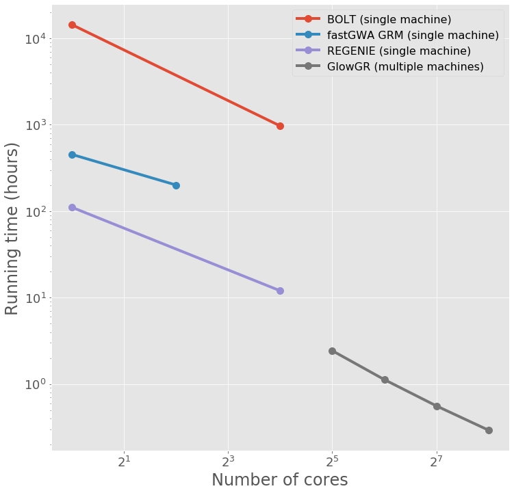

===============================
GloWGR: Whole Genome Regression
===============================

.. invisible-code-block: python

    import glow
    glow.register(spark)

    genotypes_vcf = 'test-data/gwas/genotypes.vcf.gz'
    covariates_csv = 'test-data/gwas/covariates.csv.gz'
    continuous_phenotypes_csv = 'test-data/gwas/continuous-phenotypes.csv.gz'

Glow supports Whole Genome Regression (WGR) as GloWGR, a parallelized version of the
`regenie <https://rgcgithub.github.io/regenie/>`_ method (see the
`preprint <https://www.biorxiv.org/content/10.1101/2020.06.19.162354v2>`_).

GloWGR consists of the following stages.

- Block the genotype matrix across samples and variants.
- Perform dimensionality reduction with ridge regression.
- Estimate phenotypic values with ridge regression.

.. note::

   GloWGR currently supports only quantitative phenotypes.

----------------
Data preparation
----------------

GloWGR accepts three input datasources.

Genotype data
=============

The genotype data may be read from any variant datasource supported by Glow, such as one read from
:ref:`VCF, BGEN or PLINK <variant_data>`. For scalability, recommend ingesting flat genotype files into
:ref:`Delta tables <vcf2delta>`.

The DataFrame must also include a column ``values`` containing a numeric representation of each genotype. The genotypic
values may not be missing, or equal for every sample in a variant (eg. all samples are homozygous reference).

Example
-------

When loading in the variants, perform the following transformations:

- Split multiallelic variants with the ``split_multiallelics`` transformer.
- Calculate the number of alternate alleles for biallelic variants with ``glow.genotype_states``.
- Replace any missing values with the mean of the non-missing values using ``glow.mean_substitute``.

.. code-block:: python

    from pyspark.sql.functions import col, lit

    variants = spark.read.format('vcf').load(genotypes_vcf)
    genotypes = glow.transform('split_multiallelics', variants) \
        .withColumn('values', glow.mean_substitute(glow.genotype_states(col('genotypes'))))

Phenotype data
==============

The phenotype data is represented as a Pandas DataFrame indexed by the sample ID. Each column represents a single
phenotype. It is assumed that there are no missing phenotype values, and that the phenotypes are standardized with
zero mean and unit variance.

Example
-------

Standardization can be performed with Pandas or
`scikit-learn's StandardScaler <https://scikit-learn.org/stable/modules/generated/sklearn.preprocessing.StandardScaler.html>`_.

.. code-block:: python

    import pandas as pd

    label_df = pd.read_csv(continuous_phenotypes_csv, index_col='sample_id')
    label_df = ((label_df - label_df.mean())/label_df.std(ddof=0))[['Continuous_Trait_1', 'Continuous_Trait_2']]

Covariate data
==============

The covariate data is represented as a Pandas DataFrame indexed by the sample ID. Each column represents a single
covariate. It is assumed that there are no missing covariate values, and that the covariates are standardized with
zero mean and unit variance.

Example
-------

.. code-block:: python

    covariates = pd.read_csv(covariates_csv, index_col='sample_id')
    covariates = (covariates - covariates.mean())/covariates.std(ddof=0)

------------------------
Genotype matrix blocking
------------------------

``glow.wgr.functions.block_variants_and_samples`` creates two objects: a block genotype matrix and a sample block
mapping.

Parameters
==========

- ``genotypes``: Genotype DataFrame created by reading from any variant datasource supported by Glow, such as VCF. Must
  also include a column ``values`` containing a numeric representation of each genotype.
- ``sample_ids``: List of sample IDs. Can be created by applying ``glow.wgr.functions.get_sample_ids`` to a genotype
  DataFrame.
- ``variants_per_block``: Number of variants to include per block. We recommend 1000.
- ``sample_block_count``: Number of sample blocks to create. We recommend 10.

Return
======

The function returns a block genotype matrix and a sample block mapping.

.. warning::

    Variant rows in the input DataFrame whose genotype values are uniform across all samples are filtered from the
    output block genotype matrix.

Block genotype matrix
---------------------

If we imagine the block genotype matrix conceptually, we think of an *NxM* matrix *X* where each row *n* represents an
individual sample, each column *m* represents a variant, and each cell *(n, m)* contains a genotype value for sample *n*
at variant *m*.  We then imagine laying a coarse grid on top of this matrix such that matrix cells within the same
coarse grid cell are all assigned to the same block *x*.  Each block *x* is indexed by a sample block ID (corresponding
to a list of rows belonging to the block) and a header block ID (corresponding to a list of columns belonging to the
block).  The sample block IDs are generally just integers 0 through the number of sample blocks.  The header block IDs
are strings of the form 'chr_C_block_B', which refers to the Bth block on chromosome C.  The Spark DataFrame
representing this block matrix can be thought of as the transpose of each block *xT* all stacked one atop another.  Each
row represents the values from a particular column from *X*, for the samples corresponding to a particular sample block.
The fields in the DataFrame are:

- ``header``: A column name in the conceptual matrix *X*.
- ``size``: The number of individuals in the sample block for the row.
- ``values``: Genotype values for this header in this sample block.  If the matrix is sparse, contains only non-zero values.
- ``header_block``: An ID assigned to the block *x* containing this header.
- ``sample_block``: An ID assigned to the block *x* containing the group of samples represented on this row.
- ``position``:  An integer assigned to this header that specifies the correct sort order for the headers in this block.
- ``mu``: The mean of the genotype calls for this header.
- ``sig``: The standard deviation of the genotype calls for this header.

Sample block mapping
--------------------

The sample block mapping consists of key-value pairs, where each key is a sample block ID and each value is a list of
sample IDs contained in that sample block.

The order of these IDs match the order of the ``values`` arrays in the block genotype DataFrame.

Example
=======

.. code-block:: python

    from glow.wgr.linear_model import RidgeReducer, RidgeRegression
    from glow.wgr.functions import block_variants_and_samples, get_sample_ids
    from pyspark.sql.functions import col, lit

    variants_per_block = 1000
    sample_block_count = 10
    sample_ids = get_sample_ids(genotypes)
    block_df, sample_blocks = block_variants_and_samples(
        genotypes, sample_ids, variants_per_block, sample_block_count)

------------------------
Dimensionality reduction
------------------------

The first step in the fitting procedure is to apply a dimensionality reduction to the block matrix *X* using the
``RidgeReducer``.

This is accomplished by fitting multiple ridge models within each block *x* and producing a new block matrix where each
column represents the prediction of one ridge model applied within one block. This approach to model building is
generally referred to as **stacking**. We will call the block genotype matrix we started with the **level 0** matrix in
the stack *X0*, and the output of the ridge reduction step the **level 1** matrix *X1*. The ``RidgeReducer`` class is
used for this step, which is initialized with a list of ridge regularization values (referred to here as alpha). Since
ridge models are indexed by these alpha values, the ``RidgeReducer`` will generate one ridge model per value of alpha
provided, which in turn will produce one column per block in *X0*, so the final dimensions of matrix *X1* will be
*Nx(LxK)*, where *L* is the number of header blocks in *X0* and *K* is the number of alpha values provided to the
``RidgeReducer``. In practice, we can estimate a span of alpha values in a reasonable order of magnitude based on
guesses at the heritability of the phenotype we are fitting.

Initialization
==============

When the ``RidgeReducer`` is initialized, it will assign names to the provided alphas and store them in a dictionary
accessible as ``RidgeReducer.alphas``.

Example
-------

If alpha values are not provided, they will be generated during ``RidgeReducer.fit`` based on the unique number of
headers *h* in the blocked genotype matrix *X0*, and a set of heritability values. These are only sensible if the
phenotypes are on the scale of one.

.. math::

    \vec{\alpha} = h / [0.01, 0.25, 0.50, 0.75, 0.99]

.. code-block:: python

    reducer = RidgeReducer()

Model fitting
=============

In explicit terms, the reduction of a block *x0* from *X0* to the corresponding block *x1* from *X1* is accomplished by
the matrix multiplication *x0 * B = x1*, where *B* is a coefficient matrix of size *mxK*, where *m* is the number of
columns in block *x0* and *K* is the number of alpha values used in the reduction. As an added wrinkle, if the ridge
reduction is being performed against multiple phenotypes at once, each phenotype will have its own *B*, and for
convenience we panel these next to each other in the output into a single matrix, so *B* in that case has dimensions
*mx(K*P)* where *P* is the number of phenotypes. Each matrix *B* is specific to a particular block in *X0*, so the
Spark DataFrame produced by the ``RidgeReducer`` can be thought of all of as the matrices *B* from all of the blocks
stacked one atop another.

Parameters
----------

- ``block_df``: Spark DataFrame representing the beginning block matrix.
- ``label_df``: Pandas DataFrame containing the target labels used in fitting the ridge models.
- ``sample_blocks``: Dictionary containing a mapping of sample block IDs to a list of corresponding sample IDs.
- ``covariates``: Pandas DataFrame containing covariates to be included in every model in the stacking
  ensemble (optional).

Return
------

The fields in the model DataFrame are:

- ``header_block``: An ID assigned to the header block *x0* corresponding to the coefficients in this row.
- ``sample_block``: An ID assigned to the sample block *x0* corresponding to the coefficients in this row.
- ``header``: The name of a column from the conceptual matrix *X0* that correspond with a particular row from the
  coefficient matrix *B*.
- ``alphas``: List of alpha names corresponding to the columns of *B*.
- ``labels``: List of label (i.e., phenotypes) corresponding to the columns of *B*.
- ``coefficients``: List of the actual values from a row in *B*.

Model transformation
====================

After fitting, the ``RidgeReducer.transform`` method can be used to generate *X1* from *X0*.

Parameters
----------

- ``block_df``: Spark DataFrame representing the beginning block matrix.
- ``label_df``: Pandas DataFrame containing the target labels used in fitting the ridge models.
- ``sample_blocks``: Dictionary containing a mapping of sample block IDs to a list of corresponding sample IDs.
- ``model_df``: Spark DataFrame produced by the RidgeReducer fit method, representing the reducer model.
- ``covariates``: Pandas DataFrame containing covariates to be included in every model in the stacking
  ensemble (optional).

Return
------

The output of the transformation is closely analogous to the block matrix DataFrame we started with.  The main
difference is that, rather than representing a single block matrix, it really represents multiple block matrices, with
one such matrix per label (phenotype).  Comparing the schema of this block matrix DataFrame (``reduced_block_df``) with
the DataFrame we started with (``block_df``), the new columns are:

- ``alpha``: This is the name of the alpha value used in fitting the model that produced the values in this row.
- ``label``: This is the label corresponding to the values in this row.  Since the genotype block matrix *X0* is
  phenotype-agnostic, the rows in ``block_df`` were not restricted to any label/phenotype, but the level 1 block
  matrix *X1* represents ridge model predictions for the labels the reducer was fit with, so each row is associated with
  a specific label.

The headers in the *X1* block matrix are derived from a combination of the source block in *X0*, the alpha value used in
fitting the ridge model, and the label they were fit with.  These headers are assigned to header blocks that correspond
to the chromosome of the source block in *X0*.

Example
=======

Use the ``fit_transform`` function if the block genotype matrix, phenotype DataFrame, sample block mapping, and
covariates are constant for both the model fitting and transformation.

.. code-block:: python

    reduced_block_df = reducer.fit_transform(block_df, label_df, sample_blocks, covariates)

--------------------------
Estimate phenotypic values
--------------------------

The block matrix *X1* can be used to fit a final predictive model that can generate phenotype predictions *y_hat* using
the ``RidgeRegression`` class.

Initialization
==============

As with the ``RidgeReducer`` class, this class is initialized with a list of alpha values.

Example
-------

If alpha values are not provided, they will be generated during ``RidgeRegression.fit`` based on the unique number of
headers *h* in the blocked genotype matrix *X1*, and a set of heritability values. These are only sensible if the
phenotypes are on the scale of one.

.. math::

    \vec{\alpha} = h / [0.01, 0.25, 0.50, 0.75, 0.99]

.. code-block:: python

    regression = RidgeRegression()

Model fitting
=============

This works much in the same way as the ridge reducer fitting, except that it returns two DataFrames.

Parameters
----------

- ``block_df``: Spark DataFrame representing the reduced block matrix.
- ``label_df``: Pandas DataFrame containing the target labels used in fitting the ridge models.
- ``sample_blocks``: Dictionary containing a mapping of sample block IDs to a list of corresponding sample IDs.
- ``covariates``: Pandas DataFrame containing covariates to be included in every model in the stacking
  ensemble (optional).

Return
------

The first output is a model DataFrame analogous to the model DataFrame provided by the ``RidgeReducer``.  An important
difference is that the header block ID for all rows will be 'all', indicating that all headers from all blocks have been
used in a single fit, rather than fitting within blocks.

The second output is a cross validation report DataFrame, which reports the results of the hyperparameter (i.e., alpha)
value optimization routine.

- ``label``: This is the label corresponding to the cross cv results on the row.
- ``alpha``: The name of the optimal alpha value
- ``r2_mean``: The mean out of fold r2 score for the optimal alpha value

Model transformation
====================

After fitting the ``RidgeRegression`` model, the model DataFrame and cross validation DataFrame are used to apply the
model to the block matrix DataFrame to produce predictions (*y_hat*) for each label and sample using the
``RidgeRegression.transform`` or ``RidgeRegression.transform_loco`` method. We describe the leave-one-chromosome-out
(LOCO) approach.

Parameters
----------

- ``block_df``: Spark DataFrame representing the reduced block matrix.
- ``label_df``: Pandas DataFrame containing the target labels used in fitting the ridge models.
- ``sample_blocks``: Dictionary containing a mapping of sample block IDs to a list of corresponding sample IDs.
- ``model_df``: Spark DataFrame produced by the ``RidgeRegression.fit`` method, representing the reducer model
- ``cv_df``: Spark DataFrame produced by the ``RidgeRegression.fit`` method, containing the results of the cross
  validation routine.
- ``covariates``: Pandas DataFrame containing covariates to be included in every model in the stacking
  ensemble (optional).
- ``chromosomes``: List of chromosomes for which to generate a prediction (optional). If not provided, the
  chromosomes will be inferred from the block matrix.

Return
------

The resulting *y_hat* Pandas DataFrame is shaped like ``label_df``, indexed by the sample ID and chromosome with each
column representing a single phenotype.

Example
=======

.. code-block:: python

    model_df, cv_df = regression.fit(reduced_block_df, label_df, sample_blocks, covariates)
    y_hat_df = regression.transform_loco(reduced_block_df, label_df, sample_blocks, model_df, cv_df, covariates)

.. invisible-code-block: python

    import math
    assert math.isclose(y_hat_df.at[('HG00096', '22'),'Continuous_Trait_1'], -0.5578905823446506)

Example notebook
----------------

.. notebook:: .. tertiary/glowgr.html
  :title: GloWGR notebook
